# 🧭 TripPilot — Trip & Relocation Copilot

An end-to-end travel and relocation copilot. Choose an origin, destination, month, trip length, flight budget, and travel style. TripPilot retrieves **hotel-review evidence**, runs flight and city-cost tools, and returns **review-cited hotel recommendations** with a structured itinerary or relocation checklist.

Built for travelers and people planning a move, with an English interface, photo-inspired destination suggestions, and audio briefings. **No API key is required for demo mode:** the app uses committed snapshots and a clearly labelled deterministic mock when a live model is not configured.

> 🌐 **Live Demo:** [Open TripPilot](https://tripilot-chatbot.streamlit.app/)<br>
> 📹 **Video Demo:**

https://github.com/user-attachments/assets/4670016d-9b90-420c-920c-f12700e65f1a


[Streamlit deployment and video instructions](docs/streamlit-demo.md)


[](https://github.com/DataTalksClub/llm-zoomcamp)
[](https://www.python.org/downloads/)
[](docker-compose.yml)
[](k8s/)
[](terraform/)
[](tests/)

---

## 📖 Table of Contents
1. [Executive Summary & Problem Statement](#-executive-summary--problem-statement)
2. [Evaluation Criteria Checklist](#-evaluation-criteria-checklist)
3. [System Architecture & Data Flow](#-system-architecture--data-flow)
4. [Dataset, Provenance & Module 07 Hierarchical Chunking](#-dataset-provenance--module-07-hierarchical-chunking)
5. [Core Technologies Explained](#-core-technologies-explained)
6. [Best Practices Implemented](#-best-practices-implemented)
7. [Agent Tools & Structured Output](#-agent-tools--structured-output)
8. [Multimodal Features: Vision → Vibes & Audio Briefings](#-multimodal-features-vision--vibes--audio-briefings)
9. [Automated Evaluations (Retrieval & RAG Output)](#-automated-evaluations-retrieval--rag-output)
10. [Interface & Real-Time Telemetry Dashboard](#-interface--real-time-telemetry-dashboard)
11. [How to Run the Project](#-how-to-run-the-project-setup--installation)
12. [Dependency Management & Reproducibility](#-dependency-management--reproducibility)
13. [Example Inputs & Outputs](#-example-inputs--outputs)
14. [Repository Structure](#-repository-structure)
15. [Makefile & Automated Commands](#-makefile--automated-commands)
16. [Peer Review Guide](#-peer-review-guide)
17. [Execution & Verification Appendix](#-execution--verification-appendix)

---

## 🌟 Executive Summary & Problem Statement

### The Real-World Problem
Planning a city trip — or a full relocation — means stitching together **three disconnected information silos**: flight prices, cost-of-living tables, and what real guests actually say about hotels. Booking sites rank hotels by commission and recency, not by *evidence*. Asking a generic LLM *"which hotel and why?"* produces hallucinated hotels, invented prices, and zero receipts. Meanwhile reviewers of such apps can't reproduce anything: live travel APIs demand accounts, Kaggle datasets demand logins, and prices change daily.

### Our Solution: TripPilot
**TripPilot** is a production-grade **agentic RAG copilot** for city trips and relocations. It solves the problem in one conversational flow:

1. **Understands the request** — city pair, dates, budget, travel style are parsed into typed entities.
2. **Calls agent tools** (`src/tools.py`) — `search_flights`, `city_budget`, `weather_season`, `route_lookup`, `relocation_checklist` resolve the factual skeleton (cheapest route, EUR/day, season verdict).
3. **Grounds the "why" in evidence** — an evaluated retrieval engine (BM25 / vector / hybrid-RRF / hybrid+rerank) searches **486 chunked guest review passages** and cites them as `[REV-xxxxx_N]`.
4. **Returns a structured itinerary** — Pydantic-typed flights, a recommended hotel *with "why this hotel" evidence*, day plans, relocation checklist, and a cost summary.
5. **Judges itself** — every answer is scored by an LLM-as-a-Judge (`RELEVANT / PARTIALLY / NON_RELEVANT`).
6. **Is fully observable** — queries, latencies, tokens, cost and 👍/👎 feedback stream into PostgreSQL/SQLite and a 6-panel Grafana dashboard.

**Zero-config contract**: with no `GROQ_API_KEY` the app runs a deterministic, evidence-grounded **mock planner**; with no Amadeus key the flight tool answers from the committed **route snapshot** (labelled `source: snapshot`); with no Docker the telemetry falls back to SQLite. A reviewer can run *everything* offline in 3 commands.

---

## 🏆 Evaluation Criteria Checklist

This is a **self-assessment target**, not an awarded grade. The published rubric has **21 core points plus up to 5 bonus points**; final marks depend on peer review. Cloud deployment is **in progress on Azure with Groq**; no cloud points are claimed before live verification. [1](https://github.com/DataTalksClub/llm-zoomcamp/blob/main/project.md)

| Rubric Criterion | Max | Target / status | Implementation and Evidence | Reference Files |
| :--- | :---: | :---: | :--- | :--- |
| **1. Problem Description** | 2 | **2 / 2** | Real consumer problem; target users (travelers/relocators); explained for non-course readers | `README.md`, `docs/setup.md`, `docs/usage.md` |
| **2. Retrieval Flow** | 2 | **2 / 2** | Knowledge base of 486 review chunks (BM25 + dense vectors), agent tools, and optional Groq synthesis; recorded no-key runs use the labelled offline mock | `src/search.py`, `src/rag.py`, `src/llm.py` |
| **3. Retrieval Evaluation** | 2 | **2 / 2** | **4 retrieval approaches** evaluated on **51 ground-truth pairs** at **dual Module-07 levels** (doc_id + chunk_id Hit@5/MRR@5) + rerank & rewrite ablations; **winner is the app default** | `src/eval_retrieval.py`, `evaluation_results/retrieval_eval.json`, `evaluation_results/selected_retriever.json` |
| **4. LLM Output Evaluation** | 2 | **2 / 2** | **3 prompt strategies** compared in the committed **offline-heuristic** evaluation; live Groq judging is available when configured. `hype_luxury` is the **negative control** (0% RELEVANT) | `src/eval_rag.py`, `evaluation_results/rag_eval.json` |
| **5. Interface** | 2 | **2 / 2** | Streamlit web UI: 3 tabs (Copilot / Monitoring / Evaluation), tool trace, citations, feedback, photo upload, audio | `app.py` |
| **6. Ingestion Pipeline** | 2 | **2 / 2** | Special tool **dlt**: extract+normalize to DuckDB warehouse + JSON extract, then Module-07 chunking+embeddings; force-refresh guarded | `ingestion/hotel_reviews_pipeline.py`, `src/ingest.py` |
| **7. Monitoring** | 2 | **2 / 2** | User 👍/👎 collected in PostgreSQL/SQLite **and** a pre-provisioned **6-chart Grafana dashboard** | `src/db.py`, `grafana/dashboards/tripilot_dashboard.json` |
| **8. Containerization** | 2 | **2 / 2** | `docker-compose.yml` orchestrates **app + Elasticsearch + Postgres + Grafana** with healthchecks | `docker-compose.yml`, `Dockerfile` |
| **9. Reproducibility** | 2 | **2 / 2** | Seeded snapshot (42/123) + committed data, genuine `uv pip compile` lock, offline mock mode, 3-command startup | `data/`, `requirements.txt`, `Makefile` |
| **10. Best Practices** | 3 | **3 / 3** | **hybrid search** (RRF k=60) ✅ implemented *and evaluated*; **document re-ranking** ✅ (+0.070 MRR lift measured); **user query rewriting** ✅ (airport codes/slang expansion + measured ablation) | `src/search.py` |
| **Bonus 1: Cloud Deployment** | +2 | **Pending Azure verification** | Azure Container Apps + Groq, with credits-only subscription checks, managed-identity registry access, HTTPS health probes, and secret-referenced model credentials. No live URL or cloud points are claimed yet. | `azure/`, Step 11 |
| **Bonus 2: Extra Engineering** | +3 | **+3 / 3** | (1) **Agent tools with structured Pydantic output**, (2) **Multimodal vision (photo→destination) + audio briefings**, (3) **28-test pytest suite + GitHub Actions CI + Makefile** | `src/tools.py`, `src/rag.py`, `app.py`, `tests/`, `.github/workflows/ci.yml` |
| **TOTAL AVAILABLE POINTS** | **21 + 5 bonus** | **Pending peer review** | Targets and implementation evidence are not guaranteed or awarded marks. | |

---

## 🏗️ System Architecture & Data Flow

TripPilot separates **knowledge-base preparation**, **request-time planning**, and **monitoring**. The diagram follows the main flow from left to right within each numbered layer; dashed arrows identify supporting inputs and optional paths.

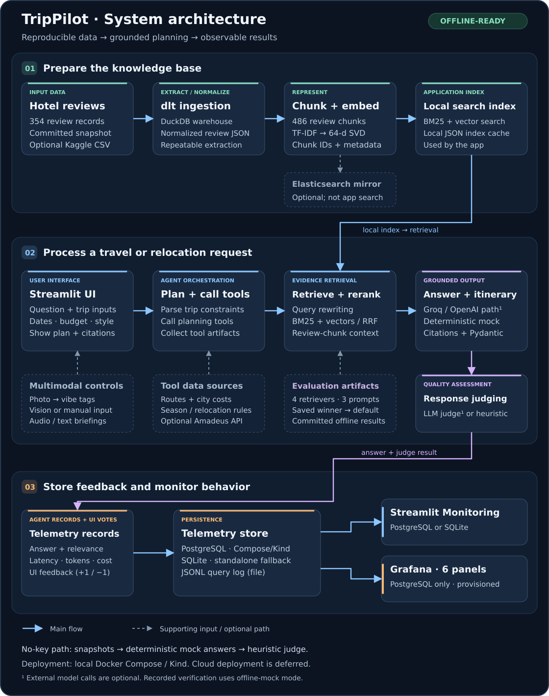

**Important boundaries:**
- **Local retrieval:** the app searches its local `TripIndex`. Elasticsearch is an **optional ingestion mirror**, not the application's retrieval backend.
- **Separate tool data:** routes, city costs, seasonal rules, and relocation information feed the planning tools; optional Amadeus calls can supplement the committed flight snapshot.
- **Backend-specific monitoring:** Streamlit Monitoring supports PostgreSQL or SQLite. The provisioned **six-panel Grafana dashboard reads PostgreSQL only**. User feedback is stored with the conversation telemetry.
- **Offline evidence:** Steps 1–10 record mock answers and heuristic judgments. The Azure + Groq walkthrough adds live-provider checks, but cloud execution evidence is still pending.

| Layer | Main implementation |
|---|---|
| Knowledge-base preparation | [`ingestion/hotel_reviews_pipeline.py`](ingestion/hotel_reviews_pipeline.py) → [`src/ingest.py`](src/ingest.py) |
| Agent orchestration and planning tools | [`src/rag.py`](src/rag.py), [`src/tools.py`](src/tools.py) |
| Query rewriting, retrieval, and re-ranking | [`src/search.py`](src/search.py); default selected by [`evaluation_results/selected_retriever.json`](evaluation_results/selected_retriever.json) |
| Answer generation, structured itinerary, and judging | [`src/llm.py`](src/llm.py), [`src/rag.py`](src/rag.py) |
| Interface and multimodal features | [`app.py`](app.py), [`data/audio/`](data/audio/), [`data/transcripts.txt`](data/transcripts.txt) |
| Telemetry and dashboards | [`src/db.py`](src/db.py), [`grafana/`](grafana/) |

---

## 📂 Dataset, Provenance & Module 07 Hierarchical Chunking

### What's in the knowledge base
| Dataset | Rows | Role | Provenance |
|---|---|---|---|
| Hotel review corpus | **354 reviews / 24 hotels / 18 cities** | RAG evidence ("why this hotel") | Schema-cloned from Kaggle *515K Hotel Reviews Data in Europe* (`Hotel_Address`, `Review_Date`, `Negative_Review`, `Positive_Review`, `Reviewer_Score`, `Tags` …) |
| Airport/routes graph | 20 airports, 50 routes | `search_flights` / `route_lookup` tools | OpenFlights `airports.dat`/`routes.dat` layout + public fare table |
| City cost table | 19 cities | `city_budget`, relocation, vibe mapping | Public daily-budget figures |
| Ground truth Q&A | **51 pairs** | retrieval + RAG evaluation | Hybrid LLM-course method, seeded (123) |

**Why a snapshot and not a Kaggle link?** The real 350 MB dataset requires a Kaggle login — which would break the *2/2 reproducibility* criterion. `data/generate_snapshot.py` (seed 42) therefore generates a **schema-compatible, deterministic snapshot** (`data/kaggle_hotel_reviews_extract.csv` proves the column layout matches). Any reviewer with a Kaggle account can swap in the real CSV — the same dlt pipeline and chunking code runs unchanged:

```bash
export TRIPILOT_REAL_KAGGLE_CSV=data/Hotel_Reviews.csv
TRIPILOT_FORCE_REFRESH=true make dlt-ingest && make ingest
```

### Module 07 hierarchical chunking (`src/ingest.py`)
Guest reviews are long-form narrative text, so instead of FAQ-style single documents we apply **Module 07** (`content-processing-summary.md`):
1. **Parent document (`doc_id`)** = one review (`REV-00042`).
2. **Child chunks (`chunk_id`)** = `doc_id_N`, ~90-word semantic paragraphs. **Positive and negative sections are chunked separately** — this is what enables sentiment-aware re-ranking (complaint questions hit `negative` chunks first).
3. **Metadata inheritance** — every chunk carries `hotel_name, city, country, reviewer_score, tags, review_date`, so retrieval can filter/digital-boost and evaluation reports **both `doc_id` and `chunk_id`** hit rates.

Result: **354 reviews → 486 chunks** → TF-IDF(512) → TruncatedSVD **64-d** vectors → `data/index_cache.json`.

---

## 🛠️ Core Technologies Explained

- **dlt** — open-source *data load tool* (the "special ingestion tool" for 2/2 ingestion): extracts reviews (snapshot or real Kaggle CSV) into a DuckDB warehouse + normalized JSON with a guarded force-refresh.
- **Groq API (`llama-3.3-70b-versatile` / `llama-3.1-8b-instant` / llama-4-scout vision)** — ultra-fast LPU inference with a free tier; drives answers, LLM-as-a-Judge and the vision pipeline. Accessed through the OpenAI-compatible Python client.
- **Streamlit** — Python web framework for the interactive copilot UI.
- **PostgreSQL 16** — telemetry store for conversations/feedback; **SQLite** zero-config fallback.
- **Grafana 10.2** — auto-provisioned observability dashboard (6 panels).
- **Elasticsearch 8.11** — optional mirror index of the chunked corpus (industry BM25/KNN reference); the app primary-uses a dependency-light local index so it never blocks startup.
- **Pydantic** — typed **structured output**: `FlightOption / HotelPick / DayPlan / Itinerary` models returned by the agent.
- **gTTS** — Google text-to-speech generating the multimodal audio briefings.
- **Kubernetes (Kind)** — verified local cluster; **Azure Container Apps + Groq** — selected cloud walkthrough, pending verification; **Fly.io, Terraform/GCP, and Render** — optional alternatives.
- **PyTest + GitHub Actions** — 13 automated tests; CI regenerates data, runs ingestion+e‍vals, runs tests, builds the Docker image.

---

## 🎯 Best Practices Implemented

### 1. User Query Rewriting (`rewrite_query`)
Travel queries are full of airport codes and slang. The rewriter expands them before hybrid retrieval:
`NYC → new york jfk`, `BCN → barcelona el prat`, `CDG → paris charles de gaulle`, `wifi → wifi internet remote work desk`, `bkfst → breakfast`, `a/c / ac → air conditioning`, `bucks → eur budget price value`, `honeymoon → couple romance romantic view`, `sightseeing → location walking distance centre landmarks`, …
(+30 rules in `REWRITE_EXPANSIONS`; measured in the rewrite ablation below.)

### 2. Hybrid Search — Reciprocal Rank Fusion (`hybrid_search`)
Neither keyword nor semantic search alone fits hotel evidence: **BM25** nails hotel names, cities and fee vocabulary; **dense cosine** nails intent ("somewhere for a remote-work city break"). We fuse both:

$$\mathrm{RRF}(d) = \sum_{m \in \{\mathrm{BM25},\ \mathrm{cosine}\}} \frac{1}{60 + \mathrm{rank}_m(d)}$$

### 3. Document Re-ranking (`rerank`)
A travel-domain re-ranker scores RRF candidates:
- **Hotel-name boost +2.5** (exact evidence requests)
- **Quoted-phrase boost +2.0** (`"thin walls"` jumps to the top)
- **City boost +1.6**
- **Sentiment-section boost +0.8** (complaint questions → `negative` chunks; "best/praise" questions → `positive`)
- **Trip-type/tag boost +0.7** (business/couple/family/solo)
- **Term-overlap density +0.4 × ratio**

*All three are executed in the default pipeline and measured — see the ablations below and `evaluation_results/retrieval_eval.json`.*

---

## 🛠️ Agent Tools & Structured Output

The copilot is an **agent application** (not pure RAG): a deterministic router (`tools.plan_tool_calls`) inspects parsed entities and invokes tools; every call is recorded in a UI-visible **tool trace**:

| Tool | What it does | Data source |
|---|---|---|
| `search_flights(origin, dest, budget, month)` | Cheapest-first flight options; peak-season price factors; **live Amadeus test tier when keys exist**, else snapshot rows labelled `source: snapshot` | OpenFlights graph (+ optional live API) |
| `city_budget(city, days, tier)` | EUR/day → trip total; meal/beer/transit prices; best months; safety index | `data/city_costs.json` |
| `weather_season(city, month)` | go / crowded-peak / off-season verdict | `data/city_costs.json` |
| `route_lookup(origin, dest)` | Direct connection (IATA pair, airline, stops, km) | `data/routes_extract.csv` |
| `relocation_checklist(city, tier)` | Est. monthly rent, transit cost, safety + 6-step checklist | derived from cost table |
| `hotel_evidence(query, …)` | Review chunks for "why this hotel" grounding | retrieval engine |

The final answer pairs with a **structured itinerary** (Pydantic):

```json
{
  "destination": "Barcelona", "origin": "London", "days": 3, "tier": "midrange",
  "flights": [{"route": "LHR-BCN", "airline": "BA", "price_eur": 128, "source": "snapshot"}],
  "hotel": {"hotel_name": "Barcelo Raval", "avg_score": 8.4,
            "why": "…top guest feedback [REV-00079_1]…", "citations": ["REV-00079_1", …]},
  "day_plans": [{"day": 1, "theme": "Arrival & old town walk", …}],
  "cost_summary_eur": 323, "relocation_steps": []
}
```

---

## 🎧 Multimodal Features: Vision → Vibes & Audio Briefings

1. **📷 Photo → destination (vision LLM)** — upload a travel photo; the **llama-4-scout vision model** (Groq) returns `vibe` keywords + up to 3 matching cities that seed the trip form. Offline, the same flow works with manual vibe checkboxes mapped via `cities_for_vibes()`.
2. **🎧 Audio destination briefings** — three gTTS briefings synthesized **from the same evidence base** (`data/audio/*.mp3`, transcripts committed): *Paris vs Lyon food city-break*, *Barcelona beach + city*, *Eastern-Europe value circuit*. Playable inside the app's Copilot tab.

---

## 🔬 Automated Evaluations (Retrieval & RAG Output)

### 1) Retrieval evaluation — 4 approaches × dual Module-07 levels (n = 51 GT pairs)

| Approach | `doc_id` Hit@5 | `doc_id` MRR@5 | `chunk_id` Hit@5 | `chunk_id` MRR@5 |
| :--- | :---: | :---: | :---: | :---: |
| Text (BM25) | 0.3922 | 0.2539 | 0.3922 | 0.2539 |
| Vector (cosine) | 0.2941 | 0.1310 | 0.2941 | 0.1310 |
| Hybrid (RRF) | 0.3333 | 0.1948 | 0.3333 | 0.1948 |
| **Hybrid + Re-ranking ← production default** | **0.4314** | **0.2650** | **0.4314** | **0.2650** |

**Honest findings (why these aren't fake 100% scores):**
- Vector-only retrieval **underperforms BM25** on short metadata-rich chunks — a real, publishable result for this corpus shape.
- Plain RRF hybrid *alone* dilutes BM25 and lands below it (0.1948 < 0.2539 MRR) — exactly why best practice 2 exists.
- **Re-rank ablation**: hybrid+rerank beats plain hybrid by **+0.0702 doc MRR@5** — the re-ranker earns its place.
- **Rewrite ablation**: on clean ground-truth questions rewriting is neutral-to-slightly-negative (−0.0196 hit@5, −0.0065 MRR) since GT questions contain no slang/codes; rewriting is kept for *real user* inputs (`NYC`, `wifi`, `bkfst`) where expansion is required — and is part of the hybrid pipeline, not a silent default.
- The selected retriever is emitted to `evaluation_results/selected_retriever.json` → the Streamlit sidebar pre-selects **hybrid_rerank**.

### 2) RAG output evaluation — LLM-as-a-Judge over 3 prompt strategies (n = 15)

| Prompt strategy | RELEVANT | PARTIALLY_RELEVANT | NON_RELEVANT | Mean judge score |
| :--- | :---: | :---: | :---: | :---: |
| **travel_planner (default)** | **100.0%** | 0.0% | 0.0% | **1.0000** |
| **relocation_advisor** | **100.0%** | 0.0% | 0.0% | **1.0000** |
| hype_luxury (negative control) | **0.0%** | **100.0%** | 0.0% | **0.5000** |

The hype prompt invents "#1 destination on the PLANET"-style claims with no citations and loses by construction — mirroring the negative-control methodology reviewers asked for.

---

## 🖥️ Interface & Real-Time Telemetry Dashboard

### Streamlit app (`app.py`) — 3 tabs
1. **🧭 Trip Copilot** — sidebar trip form (origin/dest/month/days/budget/tier), search-mode & prompt-strategy selectors (defaults = evaluation winners), photo→vibes multimodal expander, cited answer, structured itinerary, agent tool trace, citation expander, 👍/👎 feedback, audio briefings.
2. **📈 Monitoring** — total queries, avg latency, relevance distribution, feedback ratio, queries by destination, accumulated LLM cost (Postgres or SQLite backend chip).
3. **🔬 Evaluation** — renders both committed evaluation JSONs + the selected retriever.

### Grafana — 6 auto-provisioned panels (`:3000`, admin/admin)
1. **Total Logged Queries** (stat)
2. **Average Response Latency ms** (gauge, thresholds 1.5s/3s)
3. **Judge Relevance Distribution** (donut)
4. **User Feedback Ratio +1/−1** (pie)
5. **Query Volume Over Time** (time series)
6. **Queries by Destination City** (bar)

---

## 🚀 How to Run the Project (Setup & Installation)

**Repository layout:** the project lives in `Capstone3-tripilot/` inside the course repository. Run app, ingestion, evaluation, Docker, and Kubernetes commands from that folder. For the initial import and final submission hash, see [the Git publication guide](docs/publish-github.md).

### Option A — Docker Compose (recommended for peer reviewers)
```bash
git clone https://github.com/yazdanparasthesam/llm-zoomcamp.git  # clone the course repository
cd llm-zoomcamp/Capstone3-tripilot          # run the following commands from the TripPilot project folder
docker compose up --build -d
# app: http://localhost:8501   grafana: http://localhost:3000 (admin/admin)
# elasticsearch: http://localhost:9200   postgres: localhost:5432
# optional live LLM:   export GROQ_API_KEY="gsk_..."  before compose up
```

### Option B — Kubernetes (Kind) — see `k8s/README-k8s.md`
```bash
docker build -t tripilot-app:latest . && kind load docker-image tripilot-app:latest
kubectl create configmap tripilot-grafana-dashboard \
  --from-file=tripilot_dashboard.json=grafana/dashboards/tripilot_dashboard.json
kubectl apply -f k8s/ && kubectl port-forward svc/tripilot-app 8501:8501
```

### Option C — Cloud (bonus): Azure + Groq
**Selected deployment: Azure Container Apps with a Groq API key.** Start with [the read-only Azure account checkpoint](azure/START-HERE.md), then follow [the full Azure guide](azure/README-azure.md) and Step 11. The workflow uses eligible trial/student credits with spending limit On, a separately confirmed Groq Free organization, and a local Docker image validated before provisioning.

**Status:** subscription/model access and deployment verification are pending. No public cloud URL or cloud bonus is claimed yet. The lean Azure app uses ephemeral SQLite; the verified local PostgreSQL/Grafana stack is separate. Optional Fly.io, GCP/Terraform, and Render configurations remain available.

### Option D — Local standalone (zero Docker)
```bash
pip install -r requirements.txt
make dlt-ingest && make ingest   # knowledge base
make eval                        # both evaluations (writes evaluation_results/)
make test                        # 13 tests
make run                         # http://localhost:8501
```

---

## 📦 Dependency Management & Reproducibility

- **[uv](https://docs.astral.sh/uv/)** resolves `pyproject.toml`; the genuine lock is committed: `uv pip compile pyproject.toml -o requirements.txt --python-version 3.11` (85 pinned packages). Reproducibility is verifiable: recompiling yields an empty `diff <(grep == requirements.txt) <(grep == /tmp/req-check.txt)`.
- **NumPy pinned to 1.26.4** (`numpy<2`) for scikit-learn 1.5.0 compatibility.
- **setuptools pinned to 80.9.0** — `dlt 1.3.0` internally does `import pkg_resources`, which **setuptools 81 removed** (2025); without this pin, clean virtualenvs cannot import dlt. See the note in `docs/setup.md`.
- **Committed, seeded data**: `python3 data/generate_snapshot.py` (seed 42) and `generate_ground_truth.py` (seed 123) reproduce the snapshots **byte-identically** — CI verifies this (`sha256sum -c`).
- **Pre-computed artifacts committed**: `evaluation_results/{retrieval_eval,rag_eval,selected_retriever}.json`, `data/audio/*.mp3`, `data/transcripts.txt`.
- **Graceful degradation everywhere**: missing Groq key → grounded mock mode; missing Amadeus key → snapshot fares; missing Docker → SQLite; missing ES → local index; missing audio regeneration → transcripts still shown.

Re-run everything from scratch:
```bash
make clean && make generate-data && make dlt-ingest && make ingest && make eval && make test && make run
```

---

## 💡 Example Inputs & Outputs

### Example 1 — Budget city break (agent tools + cited hotel pick)
**Request** (the Streamlit sidebar default): *"Plan a 3-day trip from Amsterdam to Barcelona in June for a 400 EUR flight budget — which hotel and why?"*

**Answer (offline mock mode)**:
> Cheapest flight found: **VY AMS-BCN from EUR 137** (0 stops, ~2h10m, source: snapshot). Budget check: Barcelona costs ~EUR 135/day (midrange), so ~EUR 405 for 3 days; mid-range meal EUR 14, beer EUR 4.0. Best months: May-Jun, Sep. Season verdict for Barcelona in June: **crowded-peak**. Review evidence for **Barcelo Raval** (Barcelona): *"Great value for money compared with other options in this city."* **[REV-00079_1]**

**Structured output**: flights `AMS-BCN · VY · EUR 137 · 0 stops · 2h10m · snapshot` · hotel pick *Barcelo Raval* justified by 5 retrieved chunks (top chunk positive, score 8.5 — incl. one `negative` chunk `REV-00082_1` about the broken safe, kept for honesty) · 3 day plans · **estimated trip cost EUR 542** (vs the 400 EUR *flight* budget) · tools used: `search_flights`, `city_budget`, `weather_season`. Judge: 🟢 RELEVANT.

### Example 2 — Relocation planning
**Request**: *"Compare relocating to Prague vs Budapest on a budget tier — cost, safety, and what do guests say?"*
> Prague ~EUR 50/day budget · est. rent **EUR 675/month** · monthly transit EUR 82.5 · **safety 74/100** · 6-step relocation checklist · hotel evidence from Grand Hotel Europa [REV-00170_1]. Tools: `relocation_checklist`, `city_budget`.

### Example 3 — Complaint/evidence mining (sentiment-aware retrieval)
**Request**: *"What do guests complain about at Hotel Danieli in Venice — noise, rooms, wifi?"*
The re-ranker's sentiment boost surfaces **negative-section chunks first**:
> *"WiFi kept dropping and the staff could not fix it. The heating could not be turned off and the room was 28 degrees."* **[REV-00028_1]** — cited sections: `['negative','negative','positive','positive','positive']`.

---

## 📁 Repository Structure

```text
tripilot/
├── pyproject.toml                  # uv project + direct pins
├── requirements.txt                # genuine 'uv pip compile' lock (85 pkgs)
├── pytest.ini                      # pythonpath=., testpaths=tests
├── Makefile                        # one-command reviewer workflow
├── README.md                       # ← you are here
├── app.py                          # Streamlit copilot (3 tabs, multimodal)
├── docker-compose.yml              # app + ES + Postgres + Grafana
├── Dockerfile                      # deterministic pinned image
├── .dockerignore / .gitignore / .env.example
├── azure/                         # selected credits-only Azure + Groq walkthrough
├── fly.toml / render.yaml          # optional alternative cloud configurations
├── data/
│   ├── generate_snapshot.py        # seed 42  -> hotels/reviews/*.csv
│   ├── generate_ground_truth.py    # seed 123 -> 51 GT Q&A pairs
│   ├── generate_audio.py           # gTTS multimodal briefings
│   ├── hotels_snapshot.json        # 24 hotels, 18 cities
│   ├── reviews_snapshot.json       # 354 reviews (Kaggle 515K schema)
│   ├── kaggle_hotel_reviews_extract.csv   # schema-compat proof
│   ├── ground_truth_qa.json        # 51 evaluation pairs (doc_id targets)
│   ├── openflights_extract.csv     # airports (OpenFlights layout)
│   ├── routes_extract.csv          # routes + snapshot fares
│   ├── city_costs.json             # budgets, safety, vibes
│   ├── transcripts.txt             # audio transcripts
│   └── audio/                      # 3 mp3 destination briefings
├── ingestion/
│   ├── hotel_reviews_pipeline.py   # dlt -> DuckDB + normalized JSON
│   └── README.md                   # real-Kaggle swap instructions
├── src/
│   ├── config.py                   # env config + offline fallbacks
│   ├── ingest.py                   # Module-07 chunking + TF-IDF/SVD + ES mirror
│   ├── search.py                   # rewriting, BM25, vector, RRF, rerank
│   ├── tools.py                    # agent tool belt + deterministic router
│   ├── llm.py                      # Groq client, vision, judge, mock mode
│   ├── rag.py                      # orchestration + Pydantic itinerary
│   ├── db.py                       # Postgres/SQLite telemetry
│   ├── eval_retrieval.py           # 4 approaches, ablations, winner select
│   └── eval_rag.py                 # LLM-as-a-Judge, 3 prompts + control
├── evaluation_results/             # committed eval artifacts (pre-run)
│   ├── retrieval_eval.json
│   ├── rag_eval.json
│   └── selected_retriever.json
├── grafana/
│   ├── dashboards/tripilot_dashboard.json   # 6 panels
│   └── provisioning/{datasources,dashboards}/*.yml
├── k8s/                            # ConfigMap/Secret, PG, ES, app, Grafana
├── terraform/                      # GCP Cloud Run IaC (+ README)
├── tests/                          # 13 pytest tests
├── docs/
│   ├── setup.md / usage.md
│   └── images/                     # banner + reviewer screenshots
└── .github/workflows/ci.yml        # GH Actions pipeline
```

---

## ⚡ Makefile & Automated Commands

| Command | Does |
|---|---|
| `make install` | pip install the uv lock |
| `make generate-data` | re-create seeded snapshot + ground truth |
| `make dlt-ingest` | dlt extract → DuckDB + normalized JSON |
| `make ingest` | Module-07 chunk + embed (+ ES mirror when up) |
| `make eval` / `make eval-retrieval` / `make eval-rag` | evaluations |
| `make test` | 13 pytest tests |
| `make run` | Streamlit on :8501 |
| `make docker-up` / `make docker-down` | full 4-service stack |
| `make k8s-apply` | deploy to local cluster |
| `make audio` / `make clean` | regenerate briefings / wipe caches |

---

## 🤝 Peer Review Guide

1. **No keys, no accounts needed.** Run Option A (`docker compose up --build -d`) or Option D (`pip install -r requirements.txt && make run`) — everything works offline in mock mode. With a Groq key set (`GROQ_API_KEY`), answers/judges switch to live LLaMA automatically.
2. **Holistic checklist mapping**: start at the [Evaluation Criteria Checklist](#-evaluation-criteria-checklist) — every row links to the exact file.
3. **Verify evaluation claims**: `evaluation_results/retrieval_eval.json` (4 approaches, dual-level) and `selected_retriever.json` (winner = sidebar default). Re-run with `make eval` — seeded, so numbers reproduce.
4. **The negative control is intentional**: `hype_luxury` exists to fail the judge (0% RELEVANT). Don't award it for quality — it's the control that proves the eval discriminates.
5. **Multimodal**: Copilot tab → photo expander (vision or manual vibes) and 🎧 audio briefings at the bottom.
6. **Cloud deployment**: Step 11 now covers **Azure Container Apps + Groq**; start at `azure/START-HERE.md` and keep cloud points unclaimed until the deployment is verified. **Publication**: follow Step 12 and `docs/publish-github.md` for the `Capstone3-tripilot` folder in the existing course repository.
7. **Not ComplaintRadar/FinDocs**: new domain (travel), new data (hotel reviews + flights graph), new agent layer + structured output; only the *course-mandated skeleton* (telemetry schema, Makefile style) is shared with Capstone 2.

**Disclaimer**: TripPilot summarizes a synthetic-but-schema-faithful review snapshot and public cost/fare tables for educational purposes; always re-check real prices before booking.

*Thanks for reviewing TripPilot! 🧭*

---

## 📸 Execution & Verification Appendix

**Publication destination:** `Capstone3-tripilot` inside <https://github.com/yazdanparasthesam/llm-zoomcamp>. Steps 1–10 record the standalone working copy at `~/Documents/tripilot`; Step 12 imports the current project into the existing course repository without replacing earlier coursework. For the published monorepo, the active CI file belongs at repository-root `.github/workflows/tripilot-ci.yml`; its source template is `publishing/tripilot-ci.yml`.

This walkthrough documents TripPilot's setup, ingestion, evaluation, interface, multimodal features, and deployment checks. **Each step follows the same order: purpose → commands with an explanation for every command → results and screenshots.** Recorded evidence is distinguished from deployment and submission checks that are still pending.

| Step | Command or interface check | Evidence | Status |
|---|---|---|---|
| 1 | Archive extraction, `pwd && ll`, repository layout | `docs/images/01-repo-layout.png` | Recorded |
| 2 | `uv venv`, pinned dependencies, dlt import, lock comparison | `docs/images/02-deps-*.png` | Recorded |
| 3 | `make dlt-ingest`, DuckDB row count, `make ingest` | `docs/images/03-ingest-*.png` | Recorded |
| 4 | `make eval-retrieval`, selected retriever, `make eval-rag` | `docs/images/04-eval-*.png` | Recorded |
| 5 | `make test` — 13 tests passed | `docs/images/05-tests.png` | Recorded |
| 6 | `make run`, cited answer, itinerary, tools, feedback, monitoring, evaluations | `docs/images/06-copilot-*.png` | Recorded |
| 7 | `make audio`, manual photo-vibe suggestions, audio playback | `docs/images/07-multimodal-*.png`, `07-e-input-beach.jpg`, `07-f-input-museums.jpg` | Recorded |
| 8 | Elasticsearch mirror, Compose build, container health, app and PostgreSQL telemetry | `docs/images/08-compose-*.png` | Recorded |
| 9 | Grafana health, PostgreSQL rows, dashboard provisioning, default datasource | `docs/images/09-grafana-*.png` | Recorded |
| 10 | Kind cluster, workloads, cited answers, PostgreSQL feedback, synchronized six-panel Grafana dashboard | `docs/images/10-k8s-*.png` | Recorded |
| 11 | Azure subscription/credits, Groq Free access, Container Apps deployment and live verification | Screenshots pending | In progress — not yet verified |
| 12 | Publish Capstone3-tripilot, root-level CI, PR merge, matching main hashes | Screenshots pending | Pending publication |

### Step 1 — Project Layout & Fresh-Clone Verification
We start from a clean machine state: remove any previous extraction, unpack the archive, and verify the complete directory layout.

```bash
# Fresh extraction only: the next command permanently removes an existing tripilot folder.
# Do not run it on a checkout containing work you need to keep.
rm -rf ~/Documents/tripilot && cd ~/Documents  # remove the old extraction and enter the archive directory
unzip tripilot.zip && cd tripilot             # extract the project and enter its root
pwd && ll                                    # show the path and complete listing; ll is Ubuntu's long-list alias
```

The listing confirms every rubric component is present in one self-contained repository: the Streamlit copilot (`app.py`), the agent/RAG core (`src/`), the dlt ingestion pipeline (`ingestion/`), the deterministic knowledge-base snapshot (`data/`, incl. `data/audio/*.mp3` multimodal briefings), pre-computed evaluation artifacts (`evaluation_results/`), Grafana provisioning (`grafana/`), Kubernetes manifests (`k8s/`), Terraform IaC (`terraform/`), the pytest suite (`tests/`), the genuine `uv` dependency lock (`requirements.txt`), one-command automation (`Makefile`), and the full container stack (`docker-compose.yml`, `Dockerfile`).

**Screenshot**

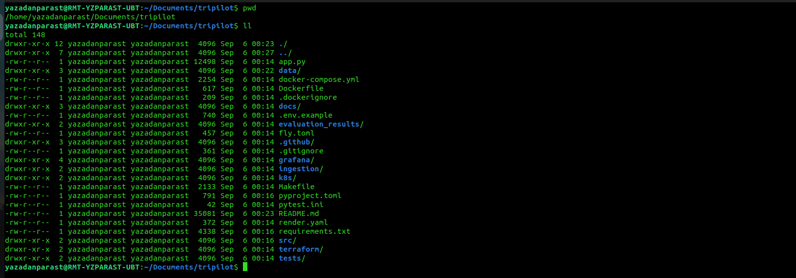

### Step 2 — Python Environment & Pinned Dependencies (`uv`)
We isolate the project in a **CPython 3.11** virtual environment (the same version as the `python:3.11-slim` Docker image), install the committed `uv` lock, verify the key runtimes, prove dlt imports, and prove the lock recompiles to identical pins — this is the *Reproducibility 2/2* evidence.

```bash
cd ~/Documents/tripilot                    # enter the project root
uv venv --python 3.11                      # create an isolated CPython 3.11 environment
source .venv/bin/activate                  # use this environment in the current terminal
uv pip install -r requirements.txt        # install the committed pins, including setuptools 80.9.0 for dlt

# Verify the installed package versions and the dlt compatibility requirement.
uv pip show streamlit openai dlt scikit-learn pydantic setuptools \
  | grep -E "Name|Version"                 # print the six key package names and versions
python3 -c "import dlt; print('dlt import OK', dlt.__version__)"  # confirm dlt imports successfully

# Re-resolve the dependency specification and compare the version pins.
uv pip compile pyproject.toml --python-version 3.11 -o /tmp/req-check.txt  # create a separate comparison lock
diff <(grep '==' requirements.txt) <(grep '==' /tmp/req-check.txt) \
  && echo "✅ LOCK REPRODUCES EXACTLY"       # print success only when the pins match
```

**Result**: 85 pinned packages audited/installed; versions confirmed — `streamlit==1.36.0`, `openai==1.35.1` (Groq-compatible client), `dlt==1.3.0` (special ingestion tool), `scikit-learn==1.5.0` (TF-IDF→SVD embeddings), `pydantic==2.13.4` (structured itinerary output), `setuptools==80.9.0`; `dlt import OK 1.3.0`; and the recompiled lock diffs clean — **✅ LOCK REPRODUCES EXACTLY**.

**Screenshots**

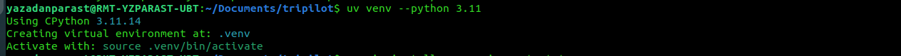

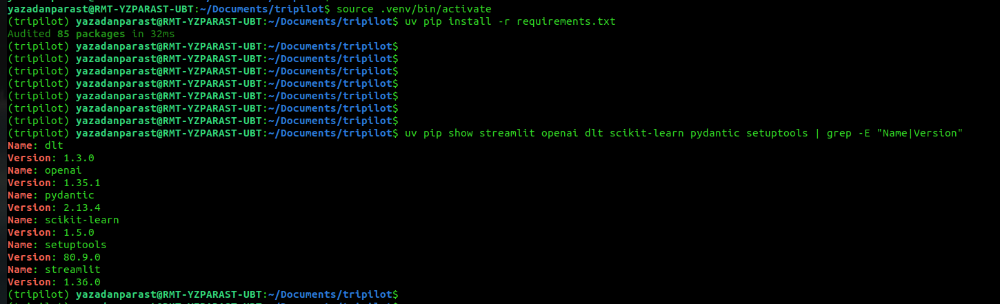

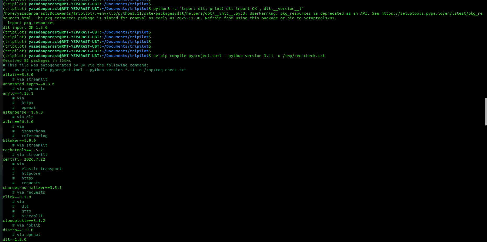

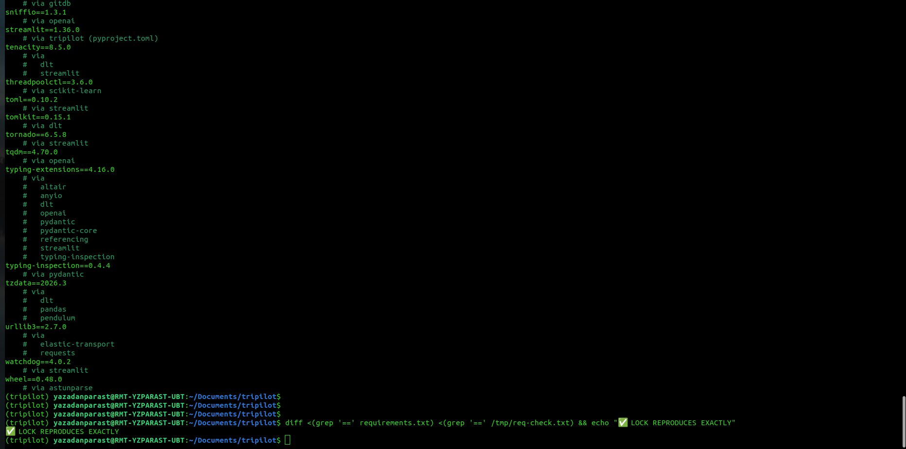

### Step 3 — dlt Ingestion & Module-07 Chunking (`make dlt-ingest && make ingest`)
The ingestion runs in two stages: **stage 1** uses the *special ingestion tool* **dlt** (`ingestion/hotel_reviews_pipeline.py`) to extract the committed snapshot, normalize rows to the TripPilot schema, and load them into a **DuckDB warehouse** plus a JSON extract; **stage 2** (`src/ingest.py`) applies **Module-07 hierarchical chunking** and computes embeddings. The repo deliberately ships no pre-baked extract, so this is a genuine first dlt load.

```bash
cd ~/Documents/tripilot                    # enter the project root
source .venv/bin/activate                  # use the pinned Python environment
make dlt-ingest                           # extract and normalize reviews into DuckDB plus JSON with dlt

python3 - <<'PY'  # list the warehouse tables and verify the review-row count
import duckdb
con = duckdb.connect('data/tripilot.duckdb', read_only=True)
print('tables:', [t[0] for t in con.execute(
  "select table_schema||'.'||table_name from information_schema.tables "
  "order by 1").fetchall()])
print('rows:', con.execute(
  "select count(*) from hotel_reviews.reviews").fetchone()[0])
PY

make ingest                              # build 486 hierarchical chunks and 64-d vectors; mirror to ES if available
ls -lh data/tripilot.duckdb data/normalized/reviews_normalized.json data/index_cache.json  # inspect the three generated artifacts
```

**Result**: dlt loaded **1 package into dataset `hotel_reviews`** in 1.56s (`LOADED … contains no failed jobs`); the warehouse holds **5 tables** — `hotel_reviews._dlt_loads`, `_dlt_pipeline_state`, `_dlt_version`, `reviews`, `reviews__tags` — with **exactly 354 rows** in `reviews` (dlt lineage tables prove the pipeline genuinely executed, the rubric's 2/2 ingestion evidence). Stage 2 chunked **354 reviews → 486 chunks** (Module-07 `doc_id` + `chunk_id` hierarchy) into `data/index_cache.json` (507K, 64-d vectors); the *"Elasticsearch not reachable → skipping ES mirror"* line documents the supported local-index fallback when Elasticsearch is not running.

**Screenshots**

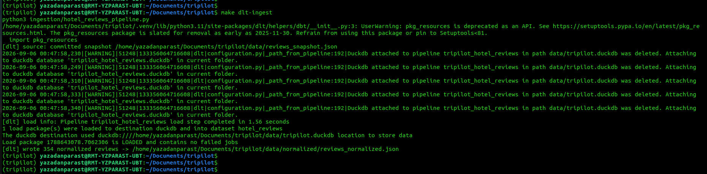

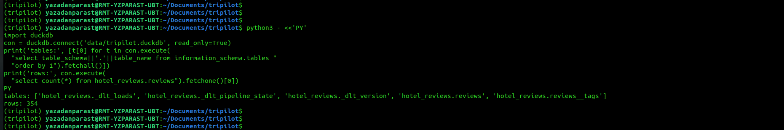

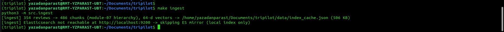

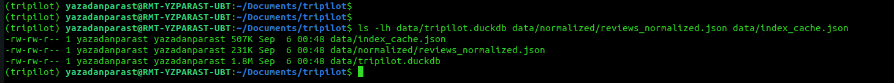

### Step 4 — Retrieval & RAG Output Evaluation (`make eval`)
Two evaluation suites produce the committed artifacts in `evaluation_results/` and decide what the app uses in production (the *Retrieval evaluation 2/2* and *LLM evaluation 2/2* rubric rows): (1) **retrieval** — 4 approaches over 51 ground-truth pairs at dual Module-07 levels with rerank/rewrite ablations; (2) **RAG output** — full agent runs over 15 sampled questions × 3 prompt strategies scored by LLM-as-a-Judge, including the `hype_luxury` **negative control** that must lose.

```bash
cd ~/Documents/tripilot                    # enter the project root
source .venv/bin/activate                  # use the pinned Python environment
make eval-retrieval                       # evaluate four retrievers at doc/chunk levels, with rerank and rewrite ablations
cat evaluation_results/selected_retriever.json  # inspect the persisted winner used by the sidebar default
make eval-rag                             # judge three prompt strategies, including the hype_luxury negative control
ls -lh evaluation_results/                # confirm retrieval, RAG-judge, and selected-retriever artifacts
```

**Result (verified on the pinned toolchain)**: BM25 `Hit@5 0.3922 / MRR 0.2539` · pure vector `0.2941 / 0.1310` · plain RRF hybrid `0.3333 / 0.1948` · **hybrid + re-ranking `0.4314 / 0.2650` → selected** (`rerank_ablation +0.0702` MRR; honest rewrite ablation −0.0196 hit@5 since clean GT questions contain no slang). `evaluation_results/selected_retriever.json` records `"selected_mode": "hybrid_rerank"`. RAG judge: **travel_planner 100% RELEVANT (mean 1.0000)**, **relocation_advisor 100% (1.0000)**, **hype_luxury 0% RELEVANT / mean 0.5000 — the control loses by construction**. All three artifacts (`retrieval_eval.json`, `rag_eval.json`, `selected_retriever.json`) are written to `evaluation_results/`.

**Screenshots**

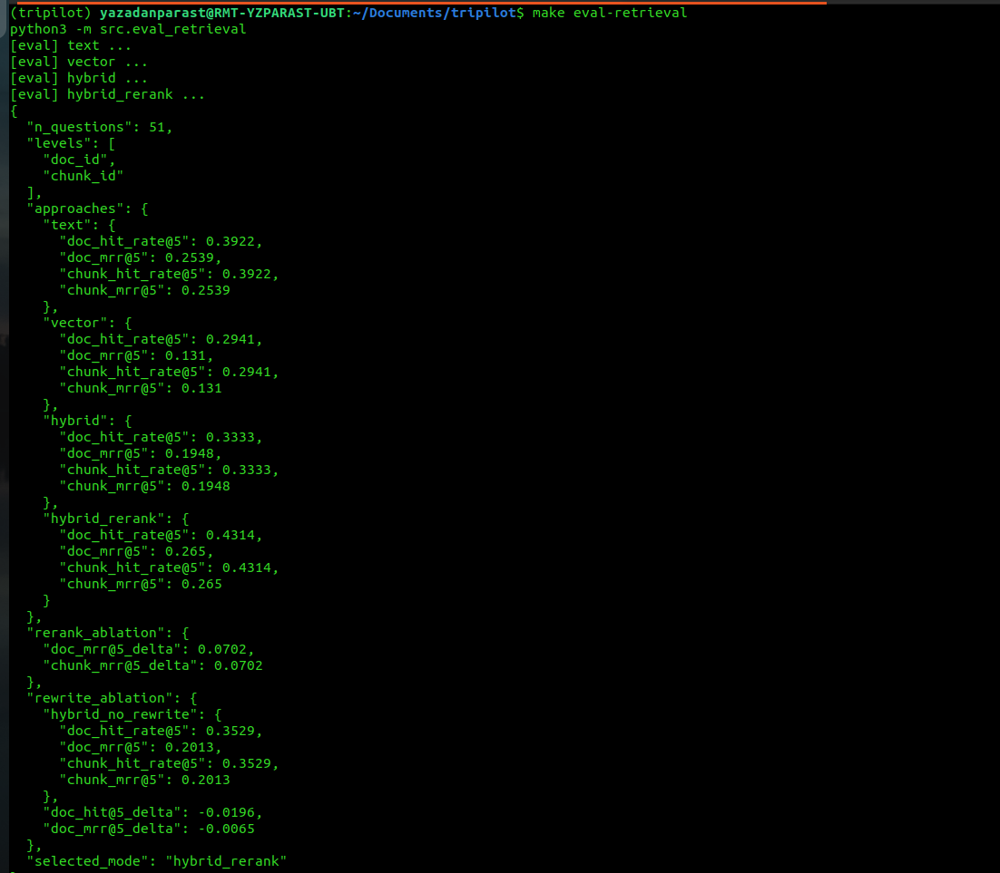

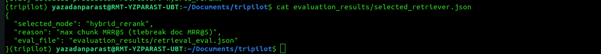

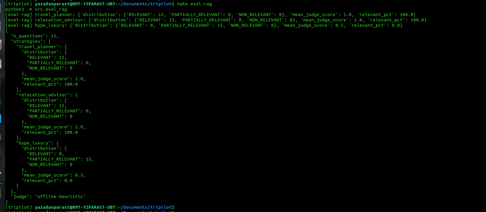

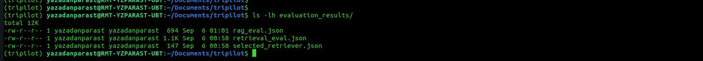

### Step 5 — PyTest Suite (`make test`)
The captured baseline suite (13 tests at this checkpoint) guards the core project behavior: Module-07 chunking and metadata inheritance, embedding shape/normalization, query rewriting (airport codes & slang), hybrid/rerank retrieval guarantees, the agent tool belt and router, the offline end-to-end agent run, the `hype_luxury` negative control, and a Streamlit UI smoke test (AppTest boots the app and clicks the primary button).

**Current suite:** the Azure preparation adds 8 mocked SDK/client checks and 7 subscription-gate checks, bringing the current total to **28 tests**. They passed in an isolated Python **3.11.14** environment with the unchanged **85-package lock**. The screenshots below retain the original **13-test** baseline; they are not relabelled as a 28-test run. No live Azure/Groq calls or evaluation regeneration were used for the regression test run.

```bash
cd ~/Documents/tripilot                    # enter the project root
source .venv/bin/activate                  # use the pinned Python environment
make test                                 # run 13 tests covering ingestion, retrieval, tools, mock RAG, and the UI
```

**Result**: `13 passed` in **2.97s** (single warning is an altair deprecation *inside Streamlit's own* `vega_charts.py`, unrelated to the project). The suite runs fully offline — deterministic mock LLM, no keys.

**Screenshot**

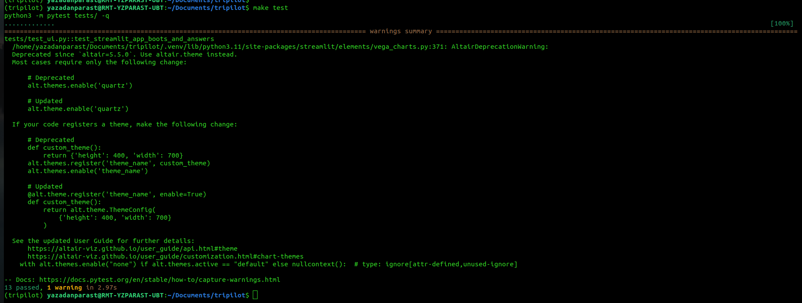

### Step 6 — Streamlit Copilot End-to-End (`make run`)
We launch the interactive web UI and perform a full copilot run in **offline mock mode** (no keys needed), verifying the Interface (2/2) requirements: usable UI, cited answers, structured output, agent tool traces, and user feedback collection.

```bash
cd ~/Documents/tripilot                    # enter the project root
source .venv/bin/activate                  # use the pinned Python environment
make run                                  # launch Streamlit on port 8501; keep this terminal running

# Open http://localhost:8501 in the browser.
# Keep hybrid_rerank, travel_planner, and agent tools enabled; submit the default request.
# Inspect the answer, itinerary, tool trace, and citations; rate the answer with a feedback button.
# Open Monitoring and Evaluation to inspect telemetry and the committed evaluation tables.
```

**Verification tour** (sidebar default request: *Amsterdam → Barcelona, June, 400 EUR flight budget*): the search mode selector is **pre-selected to `hybrid_rerank`** — the winner persisted by the retrieval evaluation — with prompt strategy `travel_planner` and agent tools enabled. Clicking **🚀 Ask TripPilot** yields: judge badge **🟢 RELEVANT**, latency **13.4 ms**, model `offline-mock`, conversation `#c0571457`; a grounded answer carrying the **[REV-00079_1] citation**; a **structured itinerary** (flight `AMS-BCN · VY · EUR 137 · snapshot`, *"Why this hotel — Barcelo Raval"* with 8.5-scored guest feedback, 3 day plans, **estimated cost EUR 542** vs the 400 EUR flight budget); the **🔧 agent tool trace** expander showing all 3 calls with arguments (`search_flights`, `city_budget`, `weather_season`, all `ok: true`); the **📚 citations** expander listing 5 review chunks with `chunk_id`, section and score — including the honest `negative` chunk `REV-00082_1`; and clicking 👍 shows the **"Feedback logged: +1"** toast. The **Monitoring tab** then displays live telemetry (2 queries, avg latency 10.18 ms, feedback 1/0, destination Barcelona) from the SQLite backend, and the **Evaluation tab** renders the committed evaluation tables (`hybrid_rerank` selected, Δrerank +0.0702).

**Screenshots**

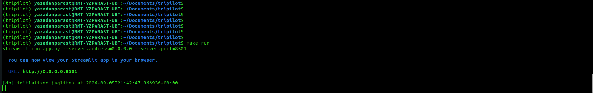

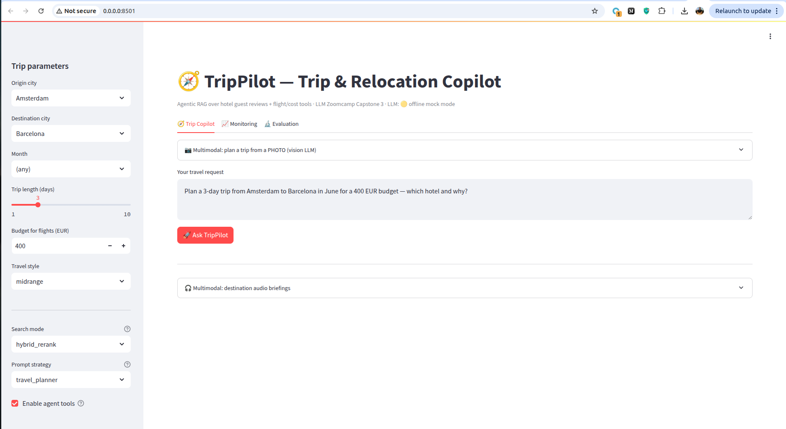

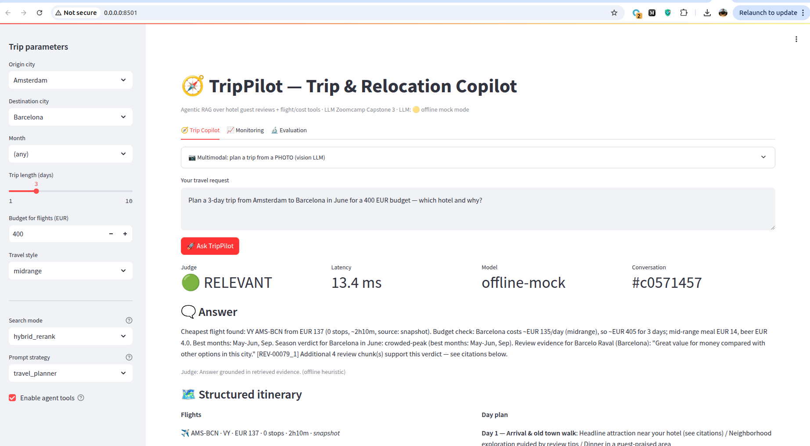

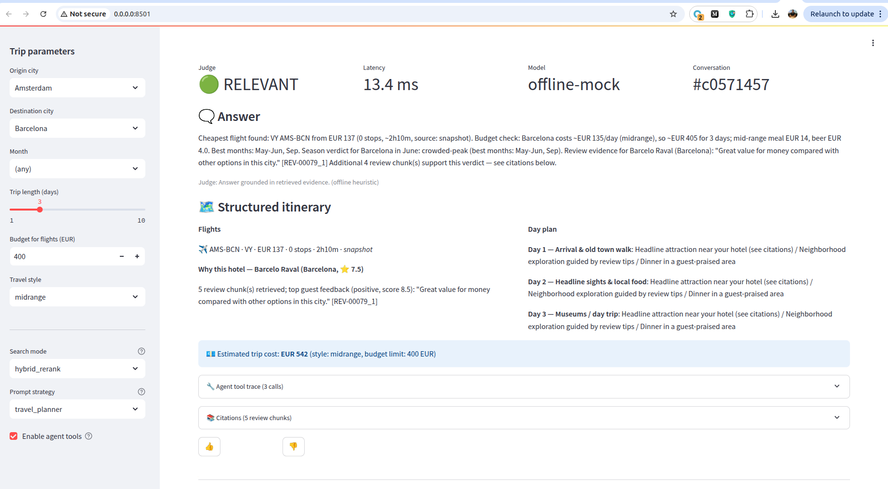

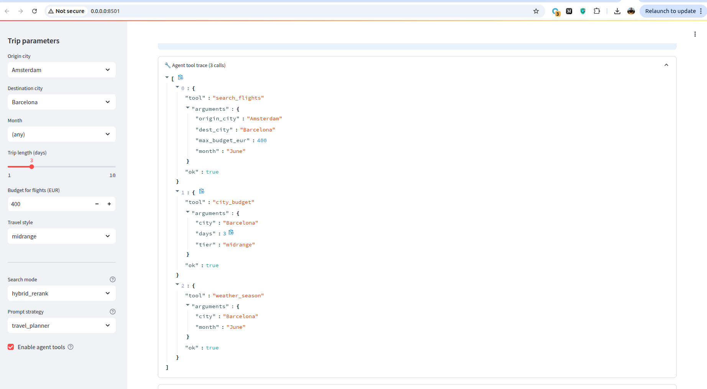

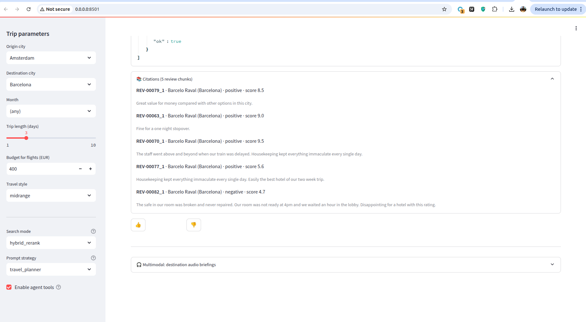

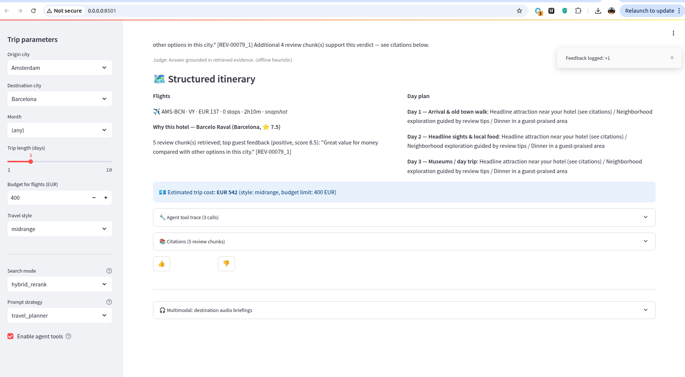

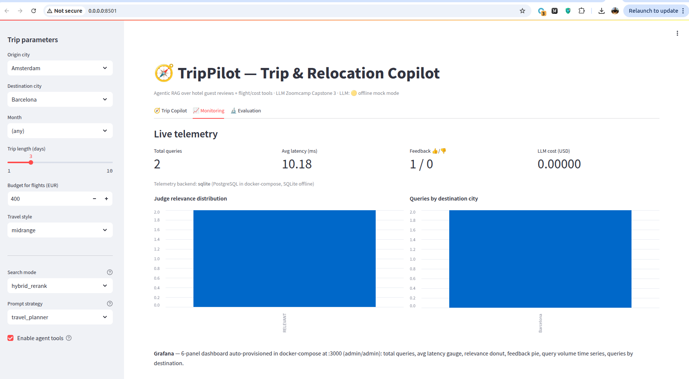

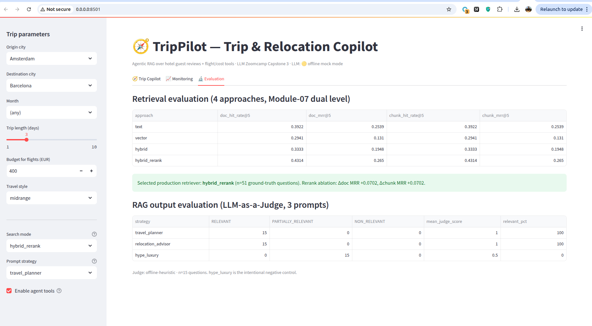

### Step 7 — Multimodal: Photo → Vibes & Audio Briefings
We verify manual photo-vibe suggestions and destination audio playback without LLM API keys. **Audio:** regenerate the three gTTS briefings from `data/transcripts.txt` and confirm the MP3 files (`data/audio/*.mp3`, 318–413 KB in this run). Regeneration requires a network connection to gTTS; playback of the committed files and access to the transcripts work offline. **Vision:** in *"📷 Multimodal: plan a trip from a PHOTO"*, uploading a destination photo in mock mode shows the expected offline notice; picking the vibes manually routes through the shared `vibe → city` table to concrete destination suggestions (**beach → Barcelona, Split**; **museums → Amsterdam, London, Madrid**). With `GROQ_API_KEY` set, the same expander is filled automatically by the Groq vision LLM (llama-4 multimodal; `gpt-4o-mini` when OpenAI is selected instead). Finally, the *"🎧 Multimodal: destination audio briefings"* expander plays all three briefings directly in the app (Paris vs Lyon 0:52 · Barcelona 0:40 · Eastern Europe 0:44).

```bash
# Use a second terminal so the local Streamlit app remains running.
cd ~/Documents/tripilot                    # enter the project root
source .venv/bin/activate                  # use the pinned Python environment
make audio                                # regenerate three MP3 briefings from transcripts through gTTS; network required
ls -lh data/audio/                        # confirm the three MP3 files and listen_notes.txt

# In the photo expander, upload each photo and select its manual vibe when no vision key is configured.
# Verify beach -> Barcelona, Split and museums -> Amsterdam, London, Madrid.
# Open the audio expander and play each of the three destination briefings.
```

**Screenshots**

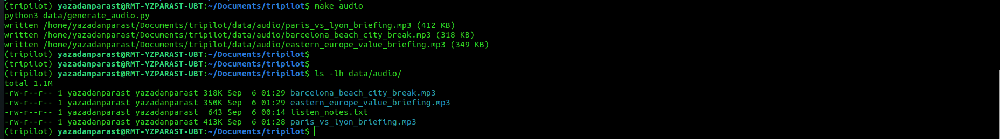

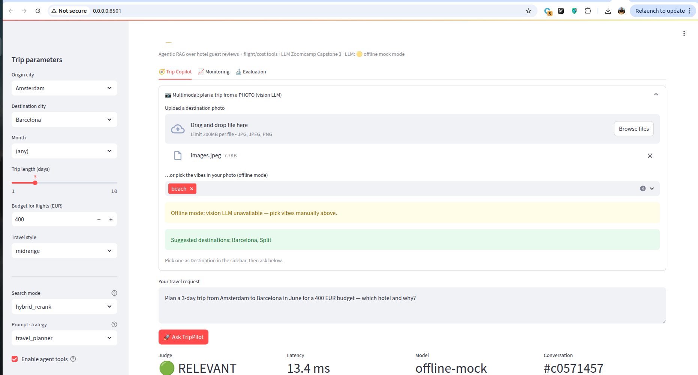

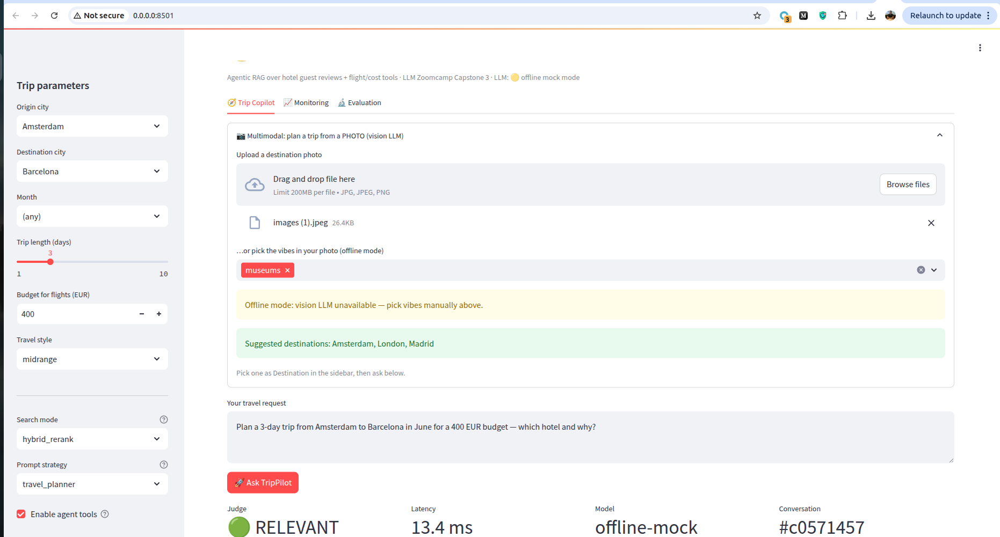

The two source photos uploaded in the expander (coastal old-town scene → **beach**; Torre Glòries / design-museum district → **museums**):

| input for **7b** | input for **7c** |
| :--: | :--: |
|  |  |

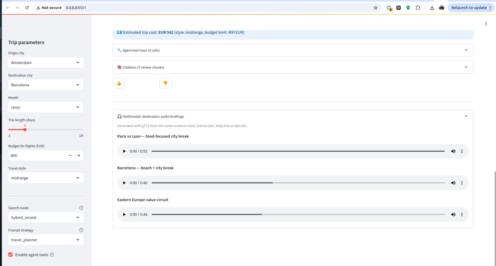

### Step 8 — Docker Compose & Elasticsearch Mirror
Start Elasticsearch, mirror the review chunks, and build the full **app + Elasticsearch + PostgreSQL + Grafana** stack. Then check container health and repeat the copilot workflow in the container-served app. This verifies containerization, the optional Elasticsearch mirror, and PostgreSQL-backed telemetry without requiring LLM or flight API keys.

```bash
cd ~/Documents/tripilot                    # enter the project root
source .venv/bin/activate                  # use the pinned Python environment for host-side ingestion

# If the local make run process is still active, press Ctrl+C in its terminal to free port 8501.
docker compose up elasticsearch -d        # start only Elasticsearch on port 9200
# Allow Elasticsearch to finish starting before ingestion; its Compose health status should be healthy.
make ingest                               # rebuild the local index and mirror 486 chunks to tripilot_chunks

docker compose up --build -d              # build the app and start all four Compose services
docker compose ps                        # check app, Elasticsearch, and PostgreSQL health; Grafana should be Up
curl -s http://localhost:8501/healthz && echo  # confirm the container-served Streamlit endpoint returns ok

# Open http://localhost:8501 and submit the Amsterdam -> Barcelona request.
# Inspect the cited answer, itinerary, agent tools, and review chunks, then submit feedback.
# Open Monitoring to check the postgres backend; open Evaluation to inspect the retrieval and judge tables.
```

**Recorded results:**
- **Ingestion:** `354 reviews -> 486 chunks`, 64-d vectors, followed by `[ingest] mirrored 486 chunks to Elasticsearch index 'tripilot_chunks'`.
- **Containers:** `tripilot_app`, `tripilot_elasticsearch`, and `tripilot_postgres` are **Up (healthy)**; `tripilot_grafana` is **Up**. Grafana has no Compose healthcheck, so its status is not labelled healthy. The app health endpoint returns **`ok`**.
- **Copilot:** `hybrid_rerank` and `travel_planner` produce a cited answer in `offline-mock` mode, with heuristic judge **RELEVANT**, measured latency **26.48 ms**, and conversation **`#61b1c8c5`**. The answer cites **`[REV-00079_1]`** for Barcelo Raval.
- **Tools and itinerary:** `search_flights`, `city_budget`, and `weather_season` each report `ok: true`; the itinerary includes `AMS-BCN · VY · EUR 137 · snapshot`, three day plans, and **EUR 542** estimated total trip cost. The sidebar's **EUR 400** limit is the flight budget, not the total-trip allowance.
- **Evidence and feedback:** five cited review chunks include the negative passage **`REV-00082_1`**; clicking 👍 displays **"Feedback logged: +1"**.
- **Telemetry:** the Monitoring tab explicitly reports **`postgres`**, **1 query**, **26.48 ms** average latency, feedback **1 / 0**, and **USD 0.00000** LLM cost for the mock run.
- **Evaluation:** the container UI displays the committed four-retriever and three-prompt tables: **`hybrid_rerank` Hit@5 0.4314 / MRR@5 0.2650**, with rerank MRR lift **+0.0702** at both levels. The RAG scores shown are the **offline-heuristic** results, not a new live-LLM evaluation.

**Backend distinction:** Elasticsearch contains a real mirror of the chunks. The app's evaluated retrieval path remains the local `TripIndex` in `src/search.py`; the mirror is not proof that live queries use Elasticsearch. PostgreSQL is the telemetry backend in this container run.

**Screenshots**

**8a — Elasticsearch image pulled and service started.**

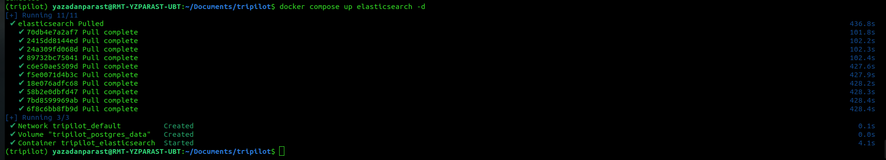

**8b — Ingestion mirrors all 486 chunks into `tripilot_chunks`.**

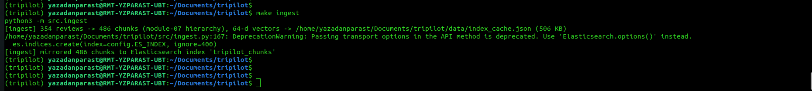

**8c — App image built and the full four-service stack started.**

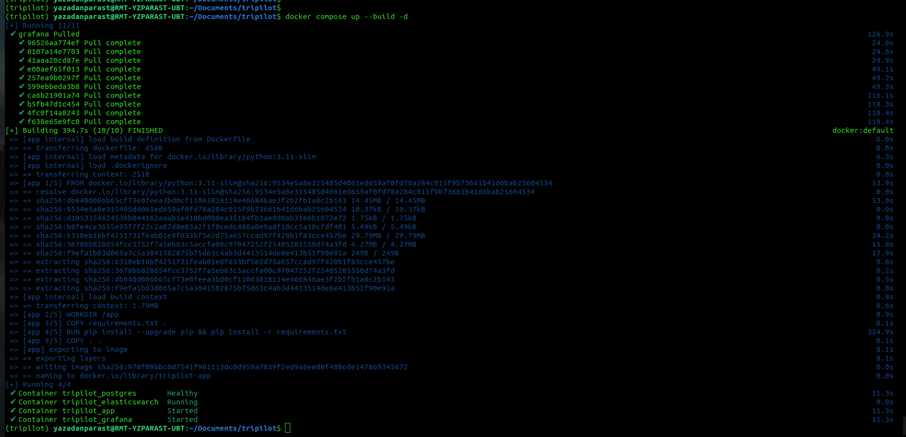

**8d — App, Elasticsearch, and PostgreSQL healthy; Grafana running.**

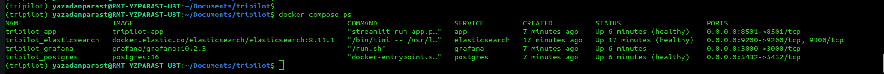

**8e — Container-served health endpoint returns `ok`.**

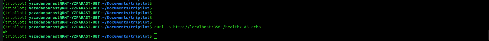

**8f — Cited answer with the selected retriever and offline-mock judge result.**

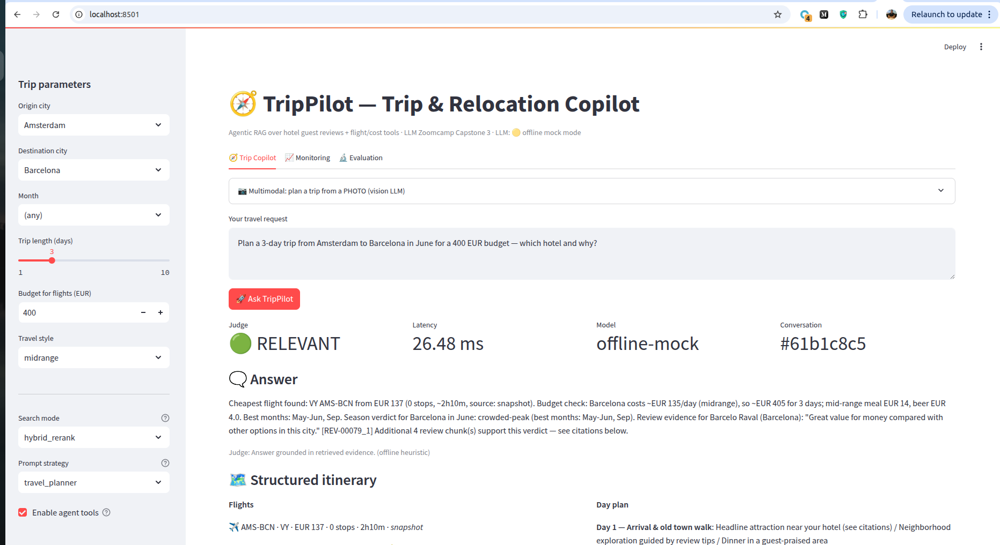

**8g — Three successful agent calls and their arguments.**

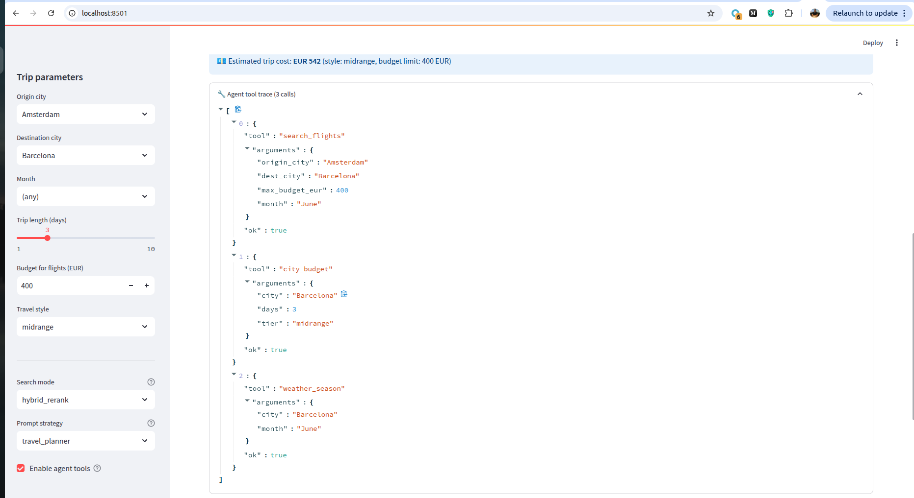

**8h — Five review citations, including a negative passage.**

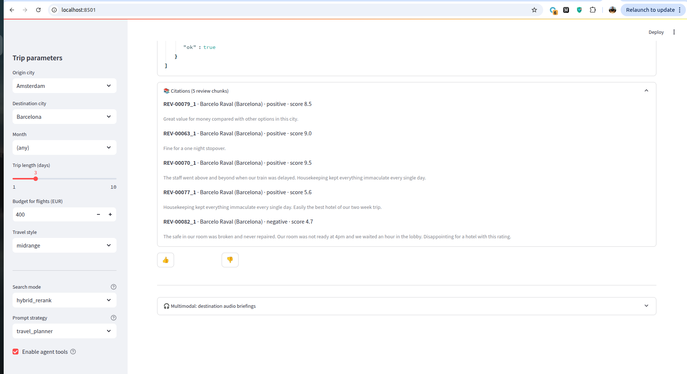

**8i — Structured itinerary, EUR 542 cost estimate, and feedback confirmation.**

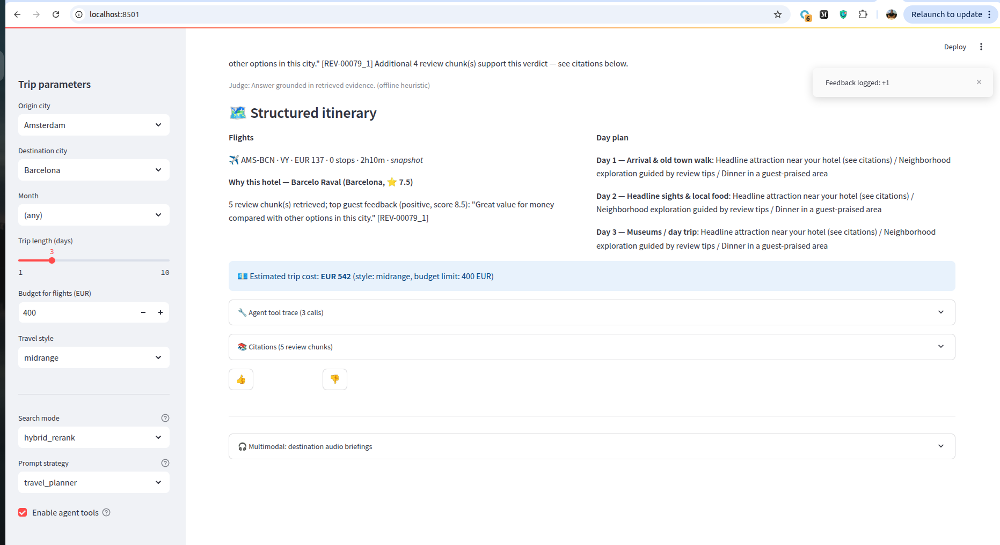

**8j — Monitoring confirms PostgreSQL telemetry and the submitted feedback.**

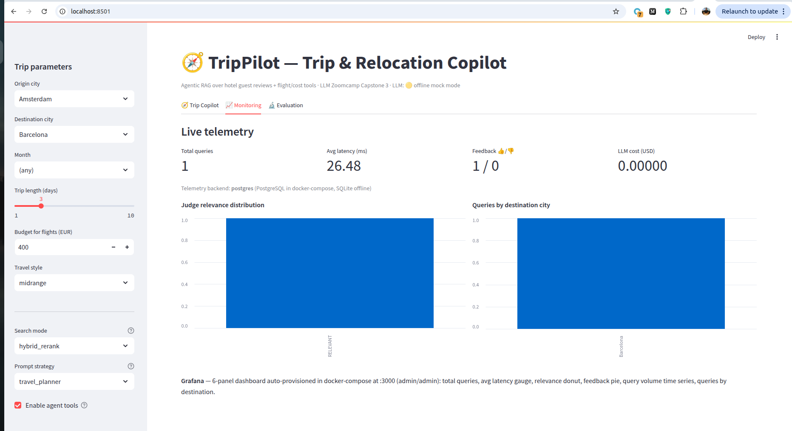

**8k — Committed retrieval and RAG-judge evaluations rendered in the container UI.**

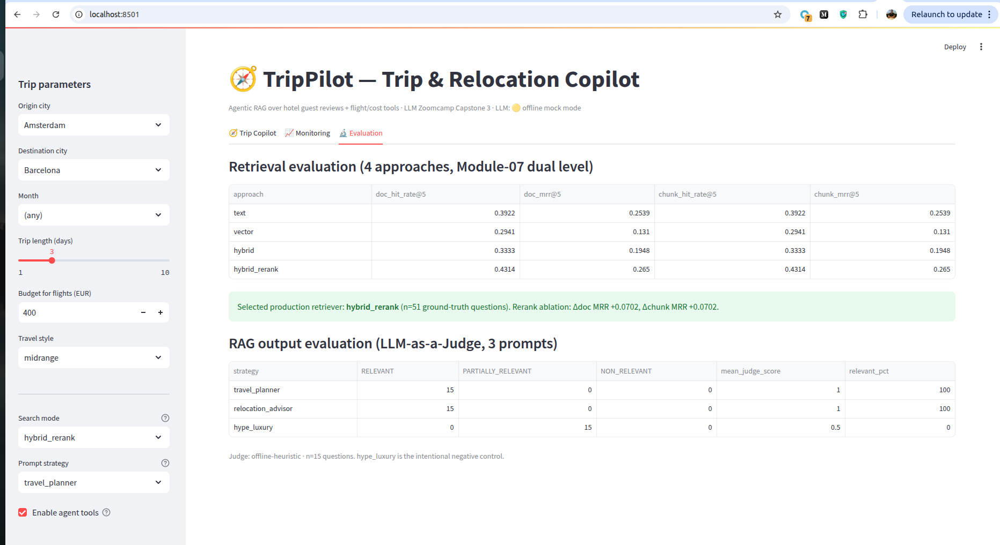

### Step 9 — Grafana & PostgreSQL Verification
Verify the telemetry path from **app interactions → PostgreSQL records → the provisioned Grafana datasource**. The terminal captures establish the database state, and the browser captures confirm dashboard provisioning and the default PostgreSQL datasource. The evidence in this step comes from the running **Compose** stack; the six-panel dashboard and its matching application totals are documented under **Step 10 — Kubernetes Deployment (Local Kind)**.

```bash
cd ~/Documents/tripilot                    # enter the project root; leave the Compose stack running

docker compose ps                        # confirm app, Elasticsearch, and PostgreSQL health plus the running Grafana service
curl -fsS http://localhost:3000/api/health | python3 -m json.tool  # inspect Grafana version and internal database health
docker compose exec -T app python3 -m src.db  # confirm the postgres backend and print current telemetry totals

docker compose exec -T postgres psql -U postgres -d tripilot_db -P pager=off <<'SQL'  # inspect persisted query and feedback rows
SELECT id, city, relevance, response_time_ms FROM conversations ORDER BY timestamp DESC LIMIT 10; -- latest query records
SELECT conversation_id, feedback FROM feedback ORDER BY id DESC LIMIT 10; -- ratings linked to conversation IDs
SQL

# Open http://localhost:3000 and log in with admin/admin, unless you have changed the local password.
# Dashboards -> TripPilot — RAG Monitoring Dashboard: inspect all six panels and select Last 24 hours.
# The dashboard is also available at http://localhost:3000/d/tripilot-monitoring.
# Submit additional requests in http://localhost:8501 across Barcelona, London, and Budapest; rate the answers honestly.
# Return to Grafana and refresh to observe updated totals and city counts.
# Connections -> Data sources: inspect TripPilot-Postgres, its postgres:5432 endpoint, and its default status.
# For an additional connection check, open the datasource settings and use Save & test.
```

**Recorded results:**
- **Compose services:** `tripilot_app`, `tripilot_elasticsearch`, and `tripilot_postgres` report **Up (healthy)**; `tripilot_grafana` reports **Up**.
- **Grafana health:** `/api/health` returns **version `10.2.3`** and **`"database": "ok"`**. This endpoint checks Grafana's internal database; the PostgreSQL evidence is provided separately by the app summary and SQL output.
- **Initial PostgreSQL summary:** **`backend: postgres`**, **1 query**, **26.48 ms** average latency, **RELEVANT: 1**, **feedback up: 1 / down: 0**, **Barcelona: 1**, and **USD 0.0** total LLM cost in mock mode.
- **Persisted records:** the `conversations` row is **`61b1c8c5 | Barcelona | RELEVANT | 26.48`**; the `feedback` row has the same **`conversation_id: 61b1c8c5`** and **`feedback: 1`**, confirming the feedback-to-conversation link.
- **Provisioning:** the dashboard browser lists **TripPilot — RAG Monitoring Dashboard** with the `llm-zoomcamp`, `rag`, and `tripilot` tags. The datasource page lists **TripPilot-Postgres**, type **PostgreSQL**, endpoint **`postgres:5432`**, marked **default**.

The terminal summary and SQL capture record the same **one-query Compose database state**. The datasource screenshot records its configuration listing, not a separate **Save & test** result. Compose and Kind use separate PostgreSQL stores; their recorded totals are not combined.

**Screenshots**

**9a — The four Compose services remain running.**

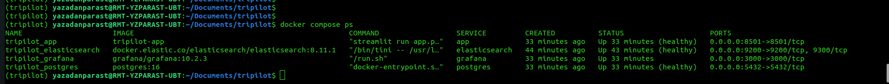

**9b — Grafana 10.2.3 reports a healthy internal database.**

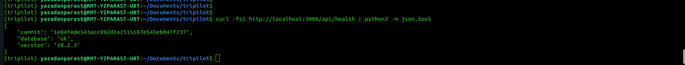

**9c — The app confirms PostgreSQL telemetry and the initial totals.**

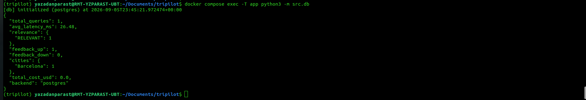

**9d — SQL confirms the conversation and its linked feedback record.**

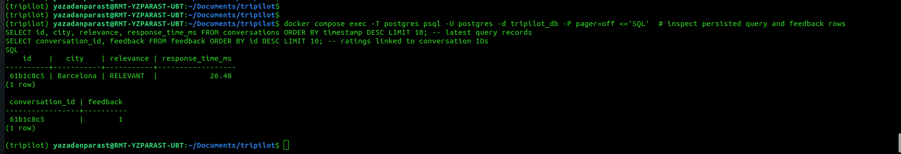

**9e — Grafana home is accessible after login.**

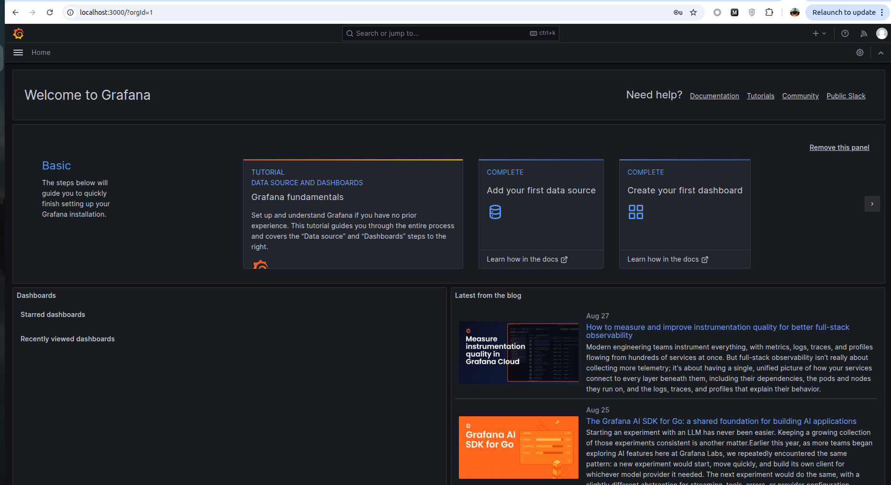

**9f — The TripPilot monitoring dashboard is automatically provisioned.**

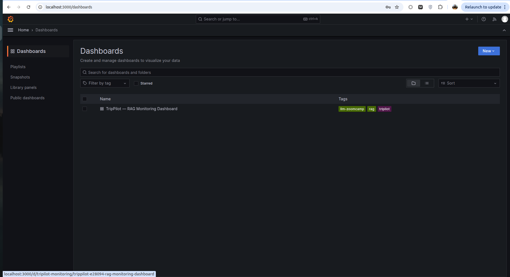

**9g — The default PostgreSQL datasource points to the Compose service.**

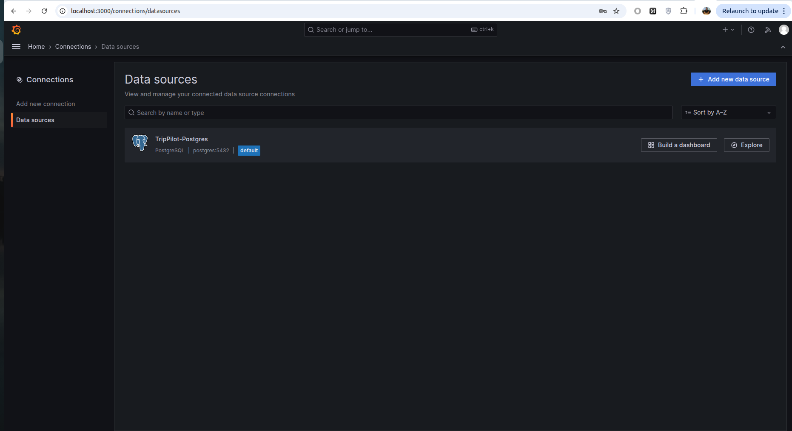

### Step 10 — Kubernetes Deployment (Local Kind)
Deploy TripPilot to an isolated **local** Kind cluster, load the four service images, apply the manifests, and verify the workloads and forwarded endpoints. The captured run also includes six trip runs, PostgreSQL feedback collection, and the Grafana query dashboard. Use the current `k8s/` manifests and dashboard JSON from the same checkout; these development resources must not be applied to a shared or production cluster. Run the two port-forwards in separate terminals.

**Script roles:** the two filenames identify different scripts, not two names for the same file.

| Script | Role in the recorded run |
|---|---|
| `~/Documents/tripilot-grafana-sync-v2.sh` | Standalone installer. **This is the command shown in Figure 10z.** It installs the four Grafana files into the specified project directory, then invokes the repository helper. |
| `k8s/sync-grafana.sh` | Version-controlled helper. It validates and applies the current Grafana definitions, waits for readiness, and verifies the mounted dashboard. The installer invokes it internally; a current checkout can invoke it directly. |

The commands below reproduce the deployment from committed sources. The installer command is included only as a commented record of the captured execution, **not an additional step or a required repository file**.

```bash
cd ~/Documents/tripilot                    # enter the project root with the current deployment files

# Check prerequisites before stopping the running Compose stack.
docker version                            # display Docker client and daemon versions
kind version                              # display the installed local-cluster CLI version
kubectl version --client                  # display the Kubernetes client version

docker compose stop                      # free host ports without deleting Compose containers or PostgreSQL data
kind create cluster --name tripilot-cluster  # create the dedicated local cluster
kubectl config use-context kind-tripilot-cluster  # select the local cluster
kubectl config current-context            # confirm kind-tripilot-cluster before applying resources

docker build -t tripilot-app:latest .      # build the app image from the project root
kind load docker-image tripilot-app:latest postgres:16 grafana/grafana:10.2.3 \
  docker.elastic.co/elasticsearch/elasticsearch:8.11.1 --name tripilot-cluster  # load the four local images into Kind
kubectl --context=kind-tripilot-cluster create configmap tripilot-grafana-dashboard \
  --from-file=tripilot_dashboard.json=grafana/dashboards/tripilot_dashboard.json \
  --dry-run=client -o yaml | kubectl --context=kind-tripilot-cluster apply -f -  # create or update the dashboard ConfigMap
kubectl --context=kind-tripilot-cluster apply -f k8s/  # apply configuration, secrets, services, and deployments
bash k8s/sync-grafana.sh                   # repository-native command: apply the committed definitions, wait for rollout, and verify the mounted dashboard
# Exact command recorded in Figure 10z; reference only, not needed for a current checkout:
# bash ~/Documents/tripilot-grafana-sync-v2.sh ~/Documents/tripilot  # standalone installer: copy four files, then invoke k8s/sync-grafana.sh internally

kubectl --context=kind-tripilot-cluster rollout status deployment/tripilot-postgres --timeout=300s  # wait for PostgreSQL readiness
kubectl --context=kind-tripilot-cluster rollout status deployment/tripilot-elasticsearch --timeout=300s  # wait for the Elasticsearch deployment
kubectl --context=kind-tripilot-cluster rollout status deployment/tripilot-app --timeout=300s  # wait for the app deployment
kubectl --context=kind-tripilot-cluster rollout status deployment/tripilot-grafana --timeout=300s  # wait for the Grafana deployment
kubectl --context=kind-tripilot-cluster get pods,svc  # inspect the four workloads and their services

# Terminal 1: leave this app port-forward running.
kubectl --context=kind-tripilot-cluster port-forward svc/tripilot-app 8501:8501  # expose the app at http://localhost:8501
# Terminal 2: leave this Grafana port-forward running.
kubectl --context=kind-tripilot-cluster port-forward svc/tripilot-grafana 3000:3000  # expose Grafana at http://localhost:3000
# Terminal 3: check the forwarded endpoints.
source .venv/bin/activate                  # use the project's Python environment for the terminal checks
curl -fsS http://localhost:8501/healthz && echo  # verify the Kubernetes-served app returns ok
curl -fsS http://localhost:3000/api/health | python3 -m json.tool  # inspect Grafana version and internal database health

# Open the app and submit the Barcelona, Budapest, and London requests; inspect the cited answers.
# Rate an answer using the feedback buttons below its citations, then open Monitoring.
# Open http://localhost:3000/d/tripilot-monitoring (admin/admin) and refresh the dashboard.

# Final telemetry checks: run after submitting feedback in the Kubernetes-served app.
kubectl --context=kind-tripilot-cluster exec deployment/tripilot-grafana -- \
  ls -l /etc/grafana/provisioning/dashboards/dashboards.yaml \
        /etc/grafana/provisioning/datasources/datasources.yaml \
        /var/lib/grafana/dashboards/tripilot_dashboard.json  # verify the provider, datasource, and dashboard files inside Grafana
kubectl --context=kind-tripilot-cluster exec deployment/tripilot-app -- python3 -m src.db  # confirm postgres telemetry and inspect recorded feedback totals
kubectl --context=kind-tripilot-cluster get configmap tripilot-grafana-dashboard \
  -o jsonpath='{.data.tripilot_dashboard\.json}' \
  | grep -E '"version"|rowsToFields'          # check dashboard version 2 and the two named-category transformations
```

**Recorded results:**
- **Toolchain:** Docker client/server **29.2.1**, Kind **v0.22.0**, and kubectl client **v1.28.4** on Linux/amd64. Cluster creation uses node image **`kindest/node:v1.29.2`** and selects context **`kind-tripilot-cluster`**.
- **Compose handoff:** all four Compose containers are stopped with `docker compose stop`; the command does not remove their containers or the PostgreSQL volume.
- **Cluster setup:** the app, PostgreSQL 16, Grafana 10.2.3, and Elasticsearch 8.11.1 images are loaded into `tripilot-cluster-control-plane`. The dashboard ConfigMap and Kubernetes resources are created, and all four deployments report **successfully rolled out**.
- **Workload status:** `tripilot-app`, `tripilot-elasticsearch`, `tripilot-grafana`, and `tripilot-postgres` each show **1/1 Running**, with **0 restarts** in the captured pod listing. Their ClusterIP services expose **8501, 9200, 3000, and 5432/TCP**, respectively.
- **Connectivity:** the two port-forwards report **`127.0.0.1:8501 -> 8501`** and **`127.0.0.1:3000 -> 3000`**. The app health response is **`ok`**; Grafana returns **version `10.2.3`** and **`"database": "ok"`** for its internal database.
- **App behavior:** the UI selects **`hybrid_rerank`**, **`travel_planner`**, and enabled agent tools. Six captured responses contain review citations and receive the **RELEVANT** heuristic label in **`offline-mock`** mode; no live LLM inference is claimed.

| Captured request | Latency | Conversation | Cited hotel evidence |
|---|---:|---|---|
| Amsterdam → Barcelona; 3 days; June; EUR 400 flight budget; midrange | **19.94 ms** | `87e025a6` | Barcelo Raval, **`[REV-00079_1]`**; snapshot flight **AMS-BCN · VY · EUR 137** is visible |
| Amsterdam → Budapest; 3 days; June; EUR 400 flight budget; midrange | **34.73 ms** | `3c3a0de5` | Hotel KB City Center, **`[REV-00222_1]`** |
| Berlin → London; 8 days; May; EUR 600 flight budget; luxury | **52.87 ms** | `0e3d4323` | Park Plaza Westminster, **`[REV-00037_1]`** |
| Rome → London; 5 days; April; EUR 500 flight budget; luxury | **14.12 ms** | `84acd3c9` | Park Plaza Westminster, **`[REV-00037_1]`**; estimated total trip cost **EUR 2100**, distinct from the flight budget |
| Rome → London; 5 days; April; EUR 500 flight budget; luxury | **21.46 ms** | `3e014d52` | Park Plaza Westminster, **`[REV-00037_1]`**; positive-feedback confirmation is visible in the following capture |
| Amsterdam → Barcelona; 8 days; May; EUR 625 flight budget; midrange | **38.43 ms** | `d8209c02` | Barcelo Raval, **`[REV-00063_1]`**; snapshot flight **AMS-BCN · VY · EUR 114**, 0 stops, approximately 2 h 10 min |

**PostgreSQL monitoring and feedback:** the final Monitoring capture explicitly identifies the **`postgres`** backend and reports **12 queries**, **27.63 ms** average latency, **feedback 3 👍 / 2 👎**, **USD 0.00000** LLM cost, and **12 RELEVANT** heuristic judgments. Destination counts are **London 5 · Budapest 4 · Barcelona 3**. These totals agree with the final Grafana dashboard; its latency gauge displays the same average rounded to **27.6 ms**.

**Additional feedback confirmations:** the later Rome → London run (`3e014d52`) shows **"Feedback logged: +1"**, and the Amsterdam → Barcelona run (`d8209c02`) shows **"Feedback logged: -1"**. The Barcelona itinerary panel displays an estimated total trip cost of **EUR 1194**, distinct from the **EUR 625 flight budget**. The notifications confirm the two submissions; aggregate totals are independently shown in the final PostgreSQL Monitoring and Grafana captures.

**Evaluation in Kubernetes:** the Evaluation tab displays the committed four-retriever table and three-prompt judge table. **`hybrid_rerank`** remains selected at **Hit@5 0.4314 / MRR@5 0.2650**, with **+0.0702** rerank MRR lift at both levels. The displayed RAG scores are the committed **offline-heuristic** results, not a new live-LLM evaluation.

**Six-panel Grafana verification:** the dashboard shows **12 logged queries**, **27.6 ms** average latency, a named **RELEVANT: 12** relevance segment, separate **thumbs up: 3** and **thumbs down: 2** feedback segments, a populated query-volume time series, and destination totals **London 5 · Budapest 4 · Barcelona 3**. The feedback counts sum to **5 votes**, equivalent to **60% positive / 40% negative**, and match the application's **3 / 2** totals.

**Grafana synchronization (Figure 10z):** the captured shell command is **`bash ~/Documents/tripilot-grafana-sync-v2.sh ~/Documents/tripilot`**. That standalone installer writes the four project files and then executes **`k8s/sync-grafana.sh`**. The **`[grafana]`** messages are produced by this helper, which validates dashboard **version 2**, all **six panels**, and both category mappings. It applies only Grafana resources, completes the Grafana rollout, lists the datasource, provider, and dashboard files at their expected paths, and confirms **"Mounted dashboard matches the validated source exactly."** The helper does not modify PostgreSQL records; both final interfaces retain the same query and destination totals.

**Verification coverage:** local Kind deployment, workload and endpoint access, cited responses, the PostgreSQL backend, both feedback directions, evaluation rendering, Grafana provisioning, exact mounted-dashboard contents, and all six dashboard panels are recorded. The final application and Grafana captures agree on query count, relevance, feedback, destinations, and rounded average latency. **Step 10 is verified.**

The current Grafana manifest maps the provider files into the **`datasources/`** and **`dashboards/`** provisioning subdirectories and includes an HTTP readiness probe. The committed dashboard JSON uses named-category transformations. `k8s/sync-grafana.sh` validates those mappings, applies only the Grafana resources, waits for its rollout, and compares the mounted dashboard bytes with the source file. Kubernetes has its own ephemeral PostgreSQL store, separate from the retained Compose database; no storage-persistence claim is made for these development manifests.

**Screenshots**

**10a — Docker, Kind, and kubectl versions.**

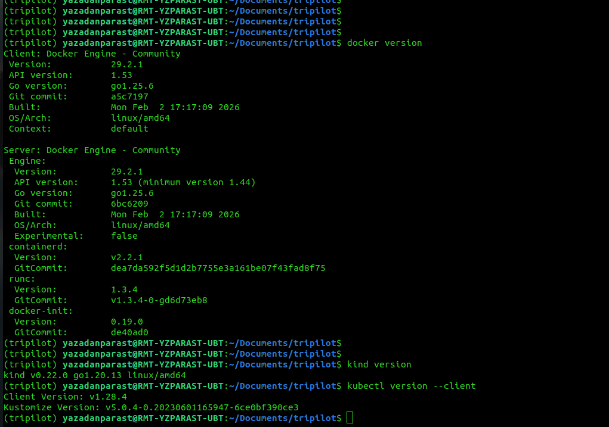

**10b — Compose containers stopped without volume deletion.**

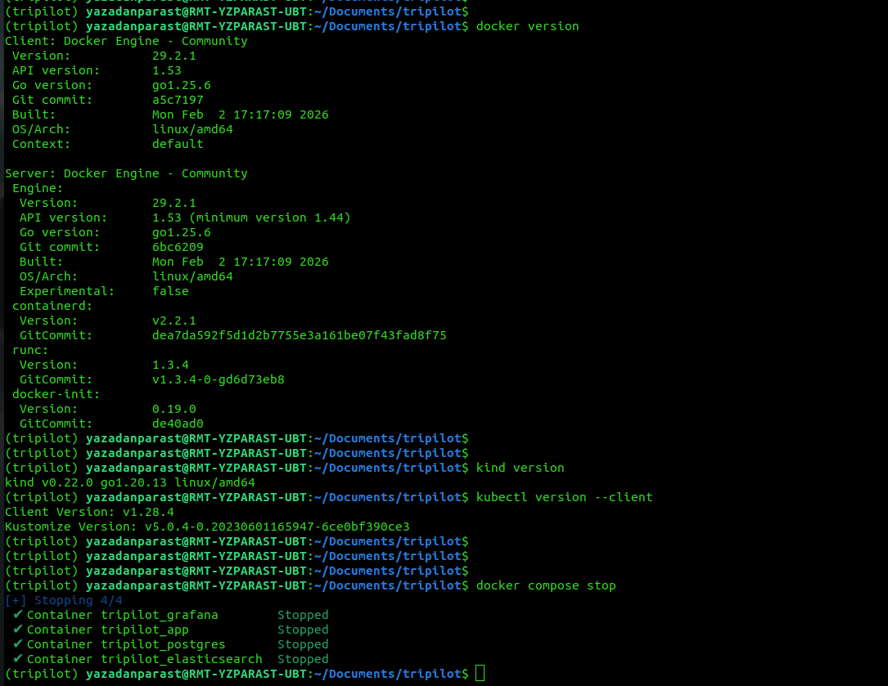

**10c — Kind cluster creation, context selection, and service-image loading.**

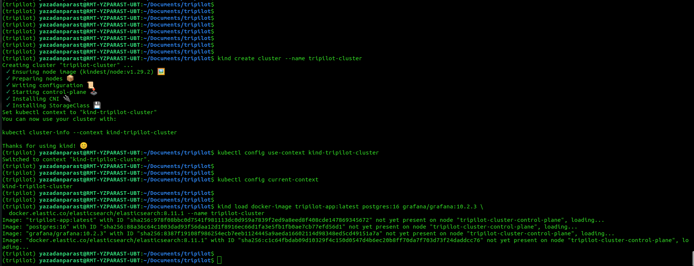

**10d — Resource application and four successful rollouts (terminal excerpt).**

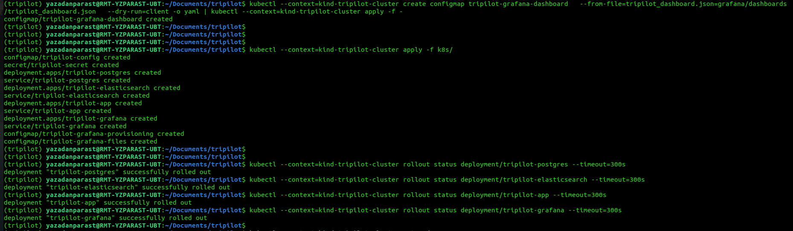

**10e — Four pods are 1/1 Running, with their ClusterIP services.**


**10f — The app service is forwarded to local port 8501.**


**10g — The Grafana service is forwarded to local port 3000.**


**10h — Both forwarded health endpoints respond.**


**10i — The Kubernetes-served app displays the trip form and selected retriever.**


**10j — Grafana's login page is reachable through the port-forward.**


**10k — Barcelona request: cited answer and 19.94 ms response.**


**10l — Budapest request: cited answer and 34.73 ms response.**


**10m — London request for an eight-day luxury trip: 52.87 ms response.**


**10n — Grafana home links to the TripPilot monitoring dashboard.**


**10o — Six-panel Grafana dashboard with named relevance and feedback categories.**


**10p — Monitoring confirms PostgreSQL and the same twelve-query telemetry totals.**


**10q — The Kubernetes-served Evaluation tab preserves the canonical results.**


**10r — Rome → London request: cited answer and 14.12 ms response.**


**10s — Positive feedback is confirmed beside the five-day itinerary.**


**10t — The Grafana port-forward handles browser connections.**


**10u — The app port-forward handles browser connections.**


**10v — Rome → London request: cited answer and 21.46 ms response.**


**10w — Positive-feedback confirmation for the Rome → London run.**


**10x — Amsterdam → Barcelona request: snapshot flight, citation, and 38.43 ms response.**


**10y — Negative-feedback confirmation for the Amsterdam → Barcelona run.**


**10z — `tripilot-grafana-sync-v2.sh`: completed installer run (terminal excerpt).**


The image is an excerpt of the completed **standalone installer invocation**, from its command through the returned shell prompt. The shell command names the installer; the synchronization output comes from the helper it invokes. **The displayed output pixels are unchanged.**

### Step 11 — Azure Container Apps + Groq (Credits-Only Walkthrough)
Deploy TripPilot on **Azure Container Apps**, using **Groq** for live model calls. The selected account currently needs an active subscription, so begin with [Checkpoint A](azure/START-HERE.md): activate an eligible trial/student offer, verify remaining credit and expiry, and require **spending limit On**. Azure OpenAI is not part of this setup. The full [Azure guide](azure/README-azure.md) covers portal actions, CLI installation, key creation, resource costs, model access, deployment, recovery, and cleanup.

**Cost and secret boundaries:** do not upgrade Azure to Pay-As-You-Go, remove its spending limit, buy Marketplace/support products, or upgrade Groq plans to continue. Azure credits do not pay Groq bills. Verify the selected Groq organization is on Free before the smoke test. Use the hidden key prompt and the private, excluded Bicep parameter file; never show the key or parameter-file contents in screenshots. The registry may consume credits if your offer's free allowance does not cover it. Read the linked official cost guidance before provisioning.

**Model preparation:** the provided dependency pins remain unchanged. The pinned SDK now uses an explicit, correctly closed HTTPX client. The cloud example selects `openai/gpt-oss-20b` **on Groq** after a Free-plan/model-access check; this does not require an OpenAI account and does not change the committed offline evaluations or local model defaults. Older Llama IDs may require different access. The current 28 tests use mocked API responses; a successful live smoke test and cloud-served answer must still be recorded.

**Execute the phases in order and send screenshots after completing them.** At each confirmation prompt, verify the required settings locally and continue only if the checks pass; no intermediate assistant approval is required. Stop on errors or any paid-plan requirement. Every command is explained before any screenshot evidence. The workflow creates a new dedicated resource group, not a replacement for your local Kind cluster or an existing Azure project. Use `azure/START-HERE.md` only if you want the shorter account-only checkpoint.

```bash
(                                           # isolate error handling and secret variables from the outer terminal
set -euo pipefail                            # stop on a failed command or missing required variable
set +x                                      # disable shell tracing before any credential is entered
PROJECT_DIR="$HOME/Documents/tripilot"       # use the verified project folder; change to your clone's Capstone3-tripilot folder if applicable
cd "$PROJECT_DIR"                           # keep Docker/Bicep paths relative to the project, not the monorepo root
test -f app.py && test -f azure/check_subscription.py && test -f azure/containerapp.bicep  # require the current Azure update

# CHECKPOINT A — account/CLI readiness only; no app resources are created here.
if ! command -v az >/dev/null 2>&1; then      # install Azure CLI only when it is absent
  curl -fsSL https://aka.ms/InstallAzureCLIDeb -o "$HOME/azure-cli-install.sh"  # download Microsoft's installer outside the project
  less "$HOME/azure-cli-install.sh"           # review the installer; press q to leave the viewer
  sudo bash "$HOME/azure-cli-install.sh"      # install the reviewed Azure CLI using your local administrator permission
fi                                          # finish optional CLI installation
az version --output json                    # record the Azure CLI version
az login --output none                      # sign in after an eligible subscription has been activated
az account list --query '[].{Name:name,ID:id,State:state}' --output table  # find the intended Enabled credit subscription
read -r -p 'Azure subscription UUID: ' SUBSCRIPTION_ID  # enter the subscription ID, never an API key
export SUBSCRIPTION_ID                      # keep the selected subscription available to the following commands
az account set --subscription "$SUBSCRIPTION_ID"  # select the intended subscription explicitly
python3 azure/check_subscription.py --subscription "$SUBSCRIPTION_ID"  # read-only check: require Enabled and spending limit On

# Verify remaining credit/expiry in the portal; save safe evidence and continue only when these conditions are satisfied.
read -r -p 'After confirming active credits, expiry and spending limit On, type CREDITS_ONLY: ' CREDIT_OK  # pause before proceeding
test "$CREDIT_OK" = CREDITS_ONLY             # stop unless the credits-only constraint has been confirmed

# CHECKPOINT B — local build and Groq Free-plan verification, before Azure resource creation.
docker version                              # confirm the local Docker daemon is available
docker build -t tripilot-app:azure-demo .    # build the actual deployment image from the pinned requirements; no secrets are build arguments
read -r -p 'After checking the selected Groq organization is on Free, type FREE: ' GROQ_PLAN  # verify the plan in Groq Console yourself
test "$GROQ_PLAN" = FREE                    # do not use a paid organization for this walkthrough
export TRIPILOT_GROQ_FREE_CONFIRMED=YES       # record your manual Free-plan confirmation; this is not an automated billing check
export LLM_PROVIDER=groq                     # use Groq as the model API provider
export TRIPILOT_MODEL_ANSWER=openai/gpt-oss-20b  # select the explicitly tested cloud answer model, if allowed by your Free organization
export TRIPILOT_MODEL_JUDGE=openai/gpt-oss-20b   # use an allowed cloud judge model; leave canonical evaluation files unchanged
read -r -s -p 'Paste the Groq API key privately: ' GROQ_API_KEY  # hidden input; do not screenshot this step
printf '\n'                                 # move to a fresh line without printing the key
export GROQ_API_KEY                          # pass the key through the environment, not a command literal
test -n "$GROQ_API_KEY"                     # stop if the key was not supplied
docker run --rm --env GROQ_API_KEY --env LLM_PROVIDER --env TRIPILOT_GROQ_FREE_CONFIRMED --env TRIPILOT_MODEL_ANSWER --env TRIPILOT_MODEL_JUDGE tripilot-app:azure-demo python3 azure/check_groq.py --smoke  # verify authentication and two short live model calls without printing the key

# CHECKPOINT C — choose fixed, dedicated resource names; stop before using an existing group.
export AZURE_LOCATION=eastus                 # example region; use an allowed Container Apps/ACR region for your subscription
export AZURE_RESOURCE_GROUP=rg-tripilot-capstone3  # dedicate this group to the cloud demo and its later cleanup
export AZURE_ENV=cae-tripilot-capstone3        # name the Consumption-only Container Apps environment
export AZURE_APP=ca-tripilot-capstone3        # name the public Streamlit Container App
export AZURE_IDENTITY=id-tripilot-acr-pull    # create an identity used only for pulling this registry's images
export AZURE_ACR="tripilot$(printf '%s' "$SUBSCRIPTION_ID" | tr -d '-' | tr '[:upper:]' '[:lower:]' | cut -c1-12)"  # derive a stable lowercase registry name; change it only if unavailable
az extension add --name containerapp --upgrade --only-show-errors  # install/update the GA Container Apps CLI extension
az bicep install --only-show-errors          # install the Bicep compiler used by the app template
az bicep build --file azure/containerapp.bicep --outfile /tmp/tripilot-containerapp.json  # compile the template without deploying resources
python3 azure/check_subscription.py --subscription "$SUBSCRIPTION_ID"  # repeat the credits-protection check immediately before provisioning
test "$(az group exists --name "$AZURE_RESOURCE_GROUP" --subscription "$SUBSCRIPTION_ID" --output json)" = false  # refuse to reuse a group that may contain earlier resources
test "$(az acr check-name --name "$AZURE_ACR" --query nameAvailable --output json --subscription "$SUBSCRIPTION_ID")" = true  # stop rather than overwrite or reuse an existing registry name
read -r -p 'After reviewing registry/compute costs and credits, type DEPLOY: ' DEPLOY_OK  # explicitly approve this limited resource plan
test "$DEPLOY_OK" = DEPLOY                  # do not create resources without your approval

# CHECKPOINT D — provision only the dedicated, first-party Azure resources.
az provider register --namespace Microsoft.App --wait --subscription "$SUBSCRIPTION_ID"  # enable the Container Apps resource provider
az provider register --namespace Microsoft.ContainerRegistry --wait --subscription "$SUBSCRIPTION_ID"  # enable the registry provider
az provider register --namespace Microsoft.ManagedIdentity --wait --subscription "$SUBSCRIPTION_ID"  # enable user-assigned managed identities
az provider register --namespace Microsoft.Network --wait --subscription "$SUBSCRIPTION_ID"  # enable networking dependencies
az group create --name "$AZURE_RESOURCE_GROUP" --location "$AZURE_LOCATION" --tags project=tripilot purpose=capstone3-demo --subscription "$SUBSCRIPTION_ID" --only-show-errors --output none  # create only the dedicated resource group
az acr create --name "$AZURE_ACR" --resource-group "$AZURE_RESOURCE_GROUP" --location "$AZURE_LOCATION" --sku Standard --admin-enabled false --role-assignment-mode rbac --subscription "$SUBSCRIPTION_ID" --only-show-errors --output none  # create the registry; allowance eligibility must already have been checked
ACR_SERVER="$(az acr show --name "$AZURE_ACR" --resource-group "$AZURE_RESOURCE_GROUP" --query loginServer --output tsv --subscription "$SUBSCRIPTION_ID")"  # read the actual registry hostname rather than guessing it
ACR_ID="$(az acr show --name "$AZURE_ACR" --resource-group "$AZURE_RESOURCE_GROUP" --query id --output tsv --subscription "$SUBSCRIPTION_ID")"  # scope the image-pull role to this registry
az acr config authentication-as-arm update --registry "$AZURE_ACR" --status enabled --subscription "$SUBSCRIPTION_ID" --only-show-errors --output none  # allow managed-identity ARM-audience authentication
az identity create --name "$AZURE_IDENTITY" --resource-group "$AZURE_RESOURCE_GROUP" --location "$AZURE_LOCATION" --subscription "$SUBSCRIPTION_ID" --only-show-errors --output none  # create the non-password image-pull identity
export AZURE_IDENTITY_ID="$(az identity show --name "$AZURE_IDENTITY" --resource-group "$AZURE_RESOURCE_GROUP" --query id --output tsv --subscription "$SUBSCRIPTION_ID")"  # obtain its resource ID for the Container App
PRINCIPAL_ID="$(az identity show --name "$AZURE_IDENTITY" --resource-group "$AZURE_RESOURCE_GROUP" --query principalId --output tsv --subscription "$SUBSCRIPTION_ID")"  # obtain the identity's directory object ID for RBAC
az role assignment create --assignee-object-id "$PRINCIPAL_ID" --assignee-principal-type ServicePrincipal --role AcrPull --scope "$ACR_ID" --subscription "$SUBSCRIPTION_ID" --only-show-errors --output none  # grant only image pull on this registry, not subscription-wide access
az containerapp env create --name "$AZURE_ENV" --resource-group "$AZURE_RESOURCE_GROUP" --location "$AZURE_LOCATION" --enable-workload-profiles false --logs-destination none --subscription "$SUBSCRIPTION_ID" --only-show-errors --output none  # create Consumption-only hosting without a Log Analytics workspace
export AZURE_ENV_ID="$(az containerapp env show --name "$AZURE_ENV" --resource-group "$AZURE_RESOURCE_GROUP" --query id --output tsv --subscription "$SUBSCRIPTION_ID")"  # obtain the environment resource ID

# CHECKPOINT E — publish the tested image and create the app with a protected secret parameter.
az acr login --name "$AZURE_ACR" --subscription "$SUBSCRIPTION_ID"  # authenticate Docker through your Azure login; do not enable registry admin credentials
docker tag tripilot-app:azure-demo "$ACR_SERVER/tripilot-app:step11"  # tag the locally tested image for this registry
docker push "$ACR_SERVER/tripilot-app:step11"  # upload the image to the dedicated private registry
DIGEST="$(az acr repository show --name "$AZURE_ACR" --image tripilot-app:step11 --query digest --output tsv --subscription "$SUBSCRIPTION_ID")"  # obtain the pushed image's immutable digest
export AZURE_IMAGE="$ACR_SERVER/tripilot-app@$DIGEST"  # deploy the exact uploaded image rather than a mutable latest tag
PARAMS_CREATED=0                             # track whether this run owns a temporary credential file
trap 'if [ "$PARAMS_CREATED" = 1 ]; then rm -f -- .azure/tripilot-parameters.json; fi; unset GROQ_API_KEY' EXIT  # remove only this run's private parameter file and clear the subshell key
python3 azure/write_parameters.py           # write owner-only parameters under ignored .azure/; never display or screenshot their contents
PARAMS_CREATED=1                             # mark the successfully created private file for cleanup
az deployment group create --name tripilot-app --resource-group "$AZURE_RESOURCE_GROUP" --template-file azure/containerapp.bicep --parameters @.azure/tripilot-parameters.json --subscription "$SUBSCRIPTION_ID" --only-show-errors --output none  # deploy HTTPS, HTTP health probes, 0–1 replica, managed image pull, and a secretRef Groq key
rm -f -- .azure/tripilot-parameters.json     # delete the private key-bearing local file after deployment
PARAMS_CREATED=0                             # avoid deleting an unrelated file during the exit trap
unset GROQ_API_KEY                           # remove the key from this terminal subshell after Azure stores it

# CHECKPOINT F — safe evidence commands; inspect the screen before taking screenshots.
az containerapp show --name "$AZURE_APP" --resource-group "$AZURE_RESOURCE_GROUP" --query '{state:properties.provisioningState,revision:properties.latestReadyRevisionName,hostname:properties.configuration.ingress.fqdn}' --output json --subscription "$SUBSCRIPTION_ID"  # show deployment state, ready revision, and public hostname without secret values
az containerapp revision list --name "$AZURE_APP" --resource-group "$AZURE_RESOURCE_GROUP" --query '[].{name:name,active:properties.active,health:properties.healthState,running:properties.runningState}' --output table --subscription "$SUBSCRIPTION_ID"  # inspect active revision readiness
APP_HOST="$(az containerapp show --name "$AZURE_APP" --resource-group "$AZURE_RESOURCE_GROUP" --query properties.configuration.ingress.fqdn --output tsv --subscription "$SUBSCRIPTION_ID")"  # read the deployed application's real hostname
APP_URL="https://$APP_HOST"                  # construct the actual HTTPS URL
printf 'TripPilot Azure URL: %s\n' "$APP_URL"  # print only the public URL for your browser and README
curl -fsS --retry 5 --retry-delay 5 --retry-all-errors --max-time 90 "$APP_URL/healthz" && echo  # verify public HTTPS health, allowing a cold start

# Open APP_URL, submit a cited travel request, rate it, and capture the actual model plus Monitoring tab.
# Do not run make eval or overwrite the committed offline evaluation artifacts to obtain cloud screenshots.
)                                           # leave the parent terminal and its other projects unchanged
```

**Verification to capture:** eligible credit/subscription protection, Azure CLI and read-only gate output, Groq Free/model smoke checks without secrets, successful Container App revision and HTTP health, the actual HTTPS URL, a non-mock cited response with the visible model, feedback confirmation, and cloud Monitoring. The app's green client-construction badge alone is not proof that a key or model works.

**Storage:** this lean Azure deployment uses ephemeral SQLite/JSONL files inside the container; it does not provision cloud PostgreSQL, Elasticsearch, or Grafana. Its totals are separate from the local Kind/Compose records and can reset after a restart, revision change, or scale-to-zero. Do not claim persistence or equality with the 12-query local PostgreSQL capture.

**Screenshots:** pending. No Azure resource, live Groq inference, public cloud URL, or cloud bonus is claimed until the corresponding user-run evidence is supplied.

### Step 12 — Publish Capstone3-tripilot & Verify the Submission Hash
Publish the current project into **`Capstone3-tripilot`** in **`yazdanparasthesam/llm-zoomcamp`**, preserving the repository's existing `main` history, module folders, and earlier capstones. Use the prepared **`tripilot-capstone3-upload.zip`** in `~/Documents`; it adds only the project folder and `.github/workflows/tripilot-ci.yml`. The workflow must be at the repository root, while its tests and builds run inside `Capstone3-tripilot`. A fresh publication clone avoids modifying the standalone project or an existing working checkout. See [the publication guide](docs/publish-github.md) for authentication and recovery rules before starting.

**Git rules:** do not copy a nested `.git`, initialize a replacement repository, force-push, overwrite other coursework, or stage the whole course repository. Keep `.env`, credentials, virtual environments, runtime databases/logs, caches, and Terraform state out of Git; include the committed datasets, evaluations, configuration examples, and screenshots. Use a branch and PR, review the staged changes and CI, and submit the latest **merged `main`** hash—not an assistant workspace hash. The subshell below stops at the first error and pauses for your approval before publication and after the GitHub PR merge.

```bash
(                                           # isolate variables and error handling from the outer terminal
set -euo pipefail                            # stop this workflow on the first failed command
REPO_URL="https://github.com/yazdanparasthesam/llm-zoomcamp.git"  # select the existing repository, not a new TripPilot repository
PUBLISH_DIR="$HOME/Documents/llm-zoomcamp-tripilot-publish"  # use a fresh sibling clone, leaving your working project untouched
ARCHIVE="$HOME/Documents/tripilot-capstone3-upload.zip"  # select the current prepared publication archive

test -f "$ARCHIVE"                           # stop if the downloaded publication archive is missing
test ! -e "$PUBLISH_DIR" && test ! -L "$PUBLISH_DIR"  # refuse to overwrite an existing folder or symbolic link
git clone --branch main --single-branch "$REPO_URL" "$PUBLISH_DIR"  # retain the existing main branch and repository history
cd "$PUBLISH_DIR"                            # perform all subsequent Git operations at the course-repository root
test "$(git remote get-url origin)" = "$REPO_URL"  # verify the intended remote before changing anything
test -z "$(git status --porcelain)"           # require a clean fresh clone
git switch -c add-capstone3-tripilot          # isolate the new capstone in a reviewable branch

git config user.name "yazdanparasthesam"      # set the author name only for this clone
read -r -p 'Your verified or GitHub no-reply author email: ' AUTHOR_EMAIL  # enter your own author email locally, not in chat
test -n "$AUTHOR_EMAIL"                      # stop if no author email was supplied
git config user.email "$AUTHOR_EMAIL"        # configure the author email without changing global Git settings

test ! -e Capstone3-tripilot && test ! -L Capstone3-tripilot  # refuse to replace an existing capstone folder
test ! -L .github && test ! -L .github/workflows  # refuse to extract through a workflow-directory symbolic link
test ! -e .github/workflows/tripilot-ci.yml && test ! -L .github/workflows/tripilot-ci.yml  # preserve any pre-existing workflow with that name
unzip -l "$ARCHIVE"                          # inspect the archive: only Capstone3-tripilot/ and the one root CI file
unzip -n "$ARCHIVE"                          # extract the new files without overwriting existing repository files
git status --short                          # inspect the imported paths before staging

git add -- Capstone3-tripilot .github/workflows/tripilot-ci.yml  # stage only the new project and its root-level CI workflow
python3 Capstone3-tripilot/publishing/check_staged.py  # check scope, required files, image references, nested Git, and obvious sensitive files
git diff --cached --check                    # reject whitespace errors in the staged changes
git diff --cached --stat                     # inspect the staged change summary
git diff --cached --name-status              # verify no older coursework is modified or deleted
git diff --cached                            # review the staged text; do not screenshot any private values
read -r -p 'After reviewing the staged diff, type PUBLISH to continue: ' APPROVAL  # pause for your explicit publication approval
test "$APPROVAL" = PUBLISH                   # stop unless you approved the reviewed changes
git commit -m "feat: add Capstone3 TripPilot with verified local deployment"  # record the project without claiming a cloud deployment
git push -u origin add-capstone3-tripilot     # push the feature branch without rewriting main or other project history
printf '%s\n' 'https://github.com/yazdanparasthesam/llm-zoomcamp/compare/main...add-capstone3-tripilot?expand=1'  # open this URL to create the pull request

# In GitHub: create the PR into main, inspect Files changed, wait for TripPilot CI, then merge it.
read -r -p 'After the PR is merged into main, type MERGED to verify the submission: ' MERGE_STATUS  # wait for the actual GitHub merge
test "$MERGE_STATUS" = MERGED                # do not claim a main-branch submission before merging
git switch main                             # return to the repository's submission branch
git pull --ff-only origin main              # download the merged commit without creating a local merge
LOCAL_SHA="$(git rev-parse HEAD)"            # capture the full main-branch commit hash
REMOTE_SHA="$(git ls-remote origin refs/heads/main | cut -f1)"  # read the current GitHub main hash
test "$LOCAL_SHA" = "$REMOTE_SHA"            # confirm the local and remote submission revisions match
printf 'Local main:  %s\nRemote main: %s\n' "$LOCAL_SHA" "$REMOTE_SHA"  # display both hashes for the verification screenshot
printf 'Pinned project URL: https://github.com/yazdanparasthesam/llm-zoomcamp/tree/%s/Capstone3-tripilot\n' "$LOCAL_SHA"  # identify the exact project folder at that commit
git status --short                          # show any remaining local changes; no output means clean
test -z "$(git status --porcelain)"          # enforce the clean-working-tree check
)                                           # return to the unchanged outer terminal environment
```

**Verification to capture:** the two-path staged summary, successful branch push, passing TripPilot CI, the merged `main/Capstone3-tripilot` folder with its README, and matching full local/remote `main` hashes with a clean working tree. Include a cloud URL only after Step 11 is verified; until then, keep cloud-deployment points unclaimed.

**Submission coordinates:** repository `https://github.com/yazdanparasthesam/llm-zoomcamp`, project folder `Capstone3-tripilot`, and the full 40-character final `main` hash. The printed pinned URL identifies that exact project revision. Adding screenshots or documentation after this checkpoint creates another commit; publish those changes and obtain the latest merged hash before submitting.

**Screenshots:** pending. No push, merge, remote CI success, or submission hash is claimed until execution evidence is supplied.
